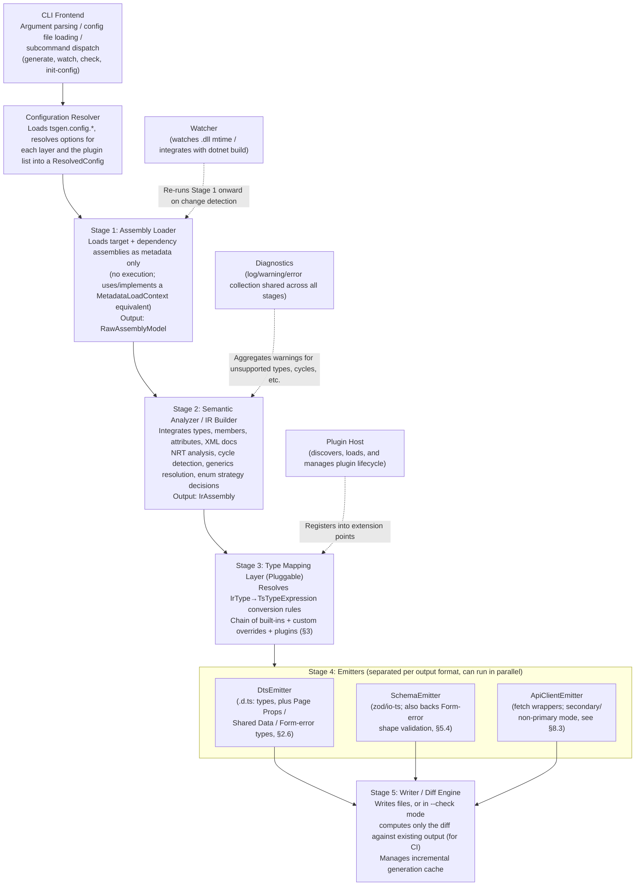
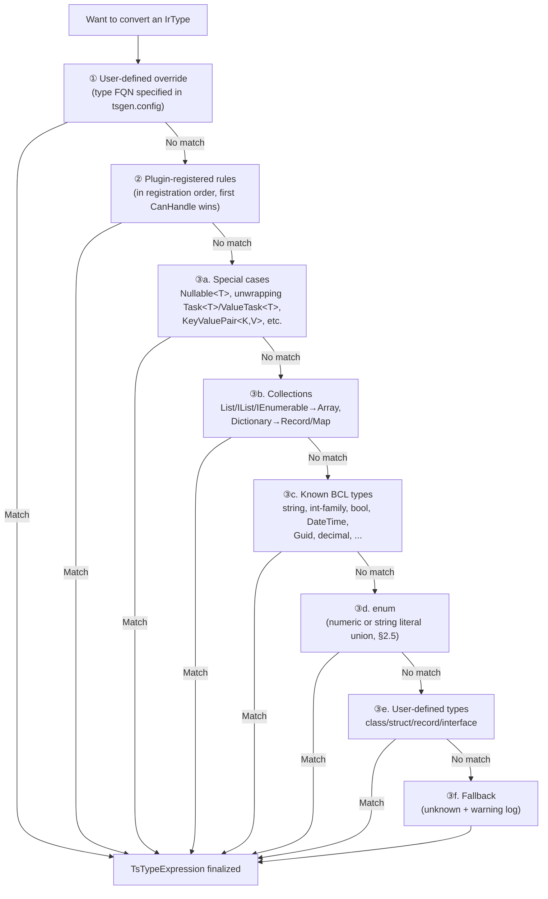
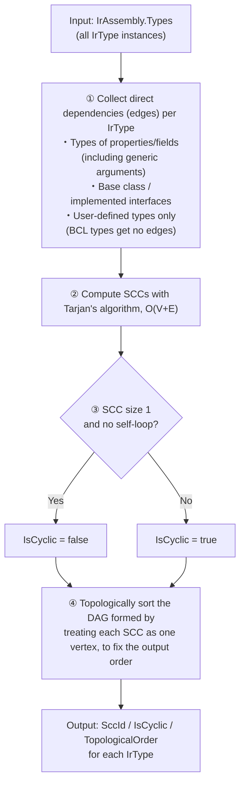
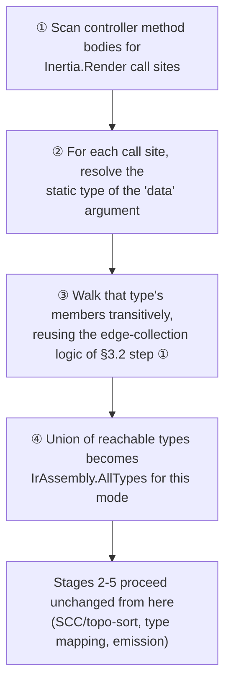
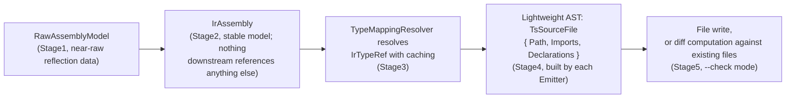

# oxygene-tsgen Design Document (Phase 1)

> 🇯🇵 [日本語版はこちら / Japanese version](./DESIGN_jp.md)

**Status**: Design phase complete. Implementation (Phase 2) not yet started.
**Scope**: Design for the maximum configuration (full scope). The MVP scope is stated explicitly at the end of this document.
**Implementation language**: Oxygene (RemObjects Elements, `.NET` target = the **Echoes** backend).

This document always states the rationale behind each design decision — no section
omits the "why" (where something is genuinely undecided, it is explicitly marked as
"undecided / needs verification"). Details on points where the decision was difficult
are organized in `HANDOFF.md`; read it alongside this document when starting Phase 2.

---

## 0. Purpose and Scope

### 0.1 Purpose

A CLI tool that loads .NET assemblies (`*.dll`) via `System.Reflection` (or an
equivalent) and generates TypeScript type definitions. **Its primary use case, as
of a scope pivot documented in `HANDOFF.md` §6, is generating TypeScript Props
types for Inertia.js page components in ASP.NET Core + Inertia.js applications**:
typing the `data` argument passed to `Inertia.Render(componentName, data)` as the
Props type consumed by the corresponding frontend page component (e.g.
`resources/js/Pages/PageName.tsx`), together with the "shared data" merged into
every page and the field-level validation-error shape consumed by Inertia's
`useForm()` client hook.

This is a narrowing from the tool's original, more general framing ("any .NET
assembly → any TypeScript output"). The underlying machinery — the type mapping
layer, the IR, NRT analysis, cycle detection — stays fully general, and the tool
continues to also work as a generic .NET → TypeScript type-definition generator
(with optional runtime validation schemas via zod/io-ts, and API client fetch
wrappers) for projects that are not using Inertia.js; see §0.2 for concrete use
cases and §8 for how the Inertia-specific and generic modes now relate.

### 0.2 Intended Use Cases

**Primary (Inertia.js):**

- Auto-generate the Props type for an Inertia.js page component directly from the
  ASP.NET Core controller action that renders it via
  `Inertia.Render(componentName, data)`, instead of hand-maintaining a duplicate
  shape on the frontend that can silently drift from the backend.
- Merge each page's own Props with "shared data" injected on every page via the
  Inertia middleware's `share()`-equivalent mechanism (current authenticated user,
  flash messages, etc.) into a single, consistent Props type (§2.6, §8.2).
- Generate the field-name → error-message shape consumed by Inertia's `useForm()`
  client hook directly from .NET validation attributes (`[Required]`, etc.), so
  frontend form-error handling stays in sync with backend validation rules without
  hand-maintained duplication (§5.4).

**Secondary (generic .NET → TypeScript, still supported, see §8.3):**

- Treat DTO/entity definitions in a .NET backend as the single source of truth more
  generally (for projects not using Inertia.js), and auto-generate frontend
  (TypeScript/React/Vue, etc.) types to prevent drift.
- Act as an alternative to, or complement for, projects that already generate
  OpenAPI, when more accurate type information (generics, nullability, enums, etc.)
  needs to be reflected in TypeScript.
- Distribute a .NET library as an internal SDK while also auto-generating a
  TypeScript client for it.

### 0.3 Non-Goals

- This tool does not "transpile" .NET to TypeScript (i.e., it does not convert
  logic/executable code). The scope is strictly types, signatures, and metadata;
  method bodies are not generated (API functions are generated only as HTTP-call
  wrappers — see §8.3 for details).
- Covering every feature of the .NET type system is not a goal (e.g., dynamic types
  expressible only through deep reflection, `dynamic`, reflection-only internal
  types, etc.). Unsupported types explicitly fall back to `unknown`/`any` with a
  warning (see §2.4 for details).
- Full modeling of C# control flow or arbitrary expression evaluation is not a
  goal. The entry-point-driven analysis introduced for the Inertia.js use case
  (§3.5) only needs to locate `Inertia.Render(...)` call sites inside controller
  action bodies and determine the static type of the `data` argument passed
  there — it does not attempt to interpret arbitrary business logic. Whether even
  this narrow amount of method-body analysis is feasible from an Oxygene-based CLI
  is itself unverified and flagged as a new technical risk in §3.5.

---

## 1. Overall Architecture

### 1.1 Component Breakdown



Supporting components (outside the pipeline above):

- **Watcher**: Monitors the filesystem (mtime of the target .dll, or integration
  with `dotnet build`) → re-runs Stage 1 onward when a change is detected.
- **Plugin Host**: Discovers, loads, and manages the lifecycle of plugins (§6).
- **Diagnostics**: Collects logs/warnings/errors shared across all stages (centrally
  aggregates fallback warnings for unsupported types, cycle-detection warnings,
  etc., and prints a summary when the CLI exits).

**Note (post-pivot, see `HANDOFF.md` §6)**: the primary output for Inertia.js
projects — Page Props / Shared Data / Form-error types — is still emitted by the
existing `DtsEmitter` as ordinary `.d.ts` output. It does not require a new Stage 4
component; what's new is additional IR inputs (§7.1) and new resolution logic
ahead of Stage 3 (§2.6, §3.5). `ApiClientEmitter`'s fetch-wrapper generation, by
contrast, is downgraded from a primary pipeline output to a secondary/optional
mode (§8.3).

### 1.2 Design Rationale: Why a Five-Stage Pipeline with an IR

- **Reason 1 (Separation of concerns)**: Mixing "how .NET metadata is read" with
  "how it's represented as TypeScript" lets the quirks of the reflection API
  (constraints of Oxygene's `System.Reflection`-compatible implementation — see §4)
  leak into the entire output logic, degrading maintainability. Interposing an IR
  ensures that changes to Stage 1/2 (e.g., adding Roslyn-based source analysis in
  the future) don't affect Stage 3/4.
- **Reason 2 (Testability)**: Since the IR is a plain data structure (POCO/record),
  unit tests for Stage 3/4 can hand-construct an IR and run without a real
  assembly, keeping them separate from Stage 1/2 tests that involve actually
  loading assemblies.
- **Reason 3 (Supporting multiple output formats)**: The three output kinds —
  `.d.ts` / zod schemas / API clients (§0.2, §7) — all need the same underlying
  information about "what the type is," so branching off a shared IR is the
  natural design. Without an IR, the same analysis logic (NRT analysis, cycle
  detection, etc.) would have to be duplicated for each output format.
- **Alternative considered**: A simplified two-stage pipeline where the Loader
  builds the TS AST directly was also considered, but rejected for the reasons
  above. Since one could argue this is over-engineering for a small CLI tool, the
  MVP (§8) will start from a "lightweight IR" that simplifies part of Stage 2
  (e.g., NRT analysis), and add full-scope analysis incrementally.

---

## 2. Type Mapping Layer: Abstraction Design

### 2.1 Basic Structure

```oxygene
type
  // TypeScript-side type expression. AST-like, but holds only the minimal
  // information needed for output.
  TsTypeExpression = public class
  public
    Kind: TsTypeKind; // Primitive, Reference, Array, Tuple, Union, Generic, Literal, Function, ...
    Name: String;               // Type name for Reference/Generic (e.g. "Array", "MyNamespace.Foo")
    TypeArguments: List<TsTypeExpression>; // Generic type arguments
    ElementType: TsTypeExpression;         // Element type for Array / Nullable Union
    UnionMembers: List<TsTypeExpression>;  // Union members (nullable is expressed as `T | null`)
    LiteralValues: List<String>;           // String literal union (when the enum strategy is "string")
  end;

  // Input/output contract for a single type mapping rule
  ITypeMappingRule = public interface
    // Determines whether this rule can handle the given IrType (used by the priority chain)
    method CanHandle(aType: IrType; aContext: MappingContext): Boolean;
    // Performs the actual conversion. Resolution of nested types (e.g. generic
    // arguments) is done by recursively calling aContext.ResolveType() (see §2.3 below)
    method Map(aType: IrType; aContext: MappingContext): TsTypeExpression;
  end;
```

### 2.2 Rule Resolution Priority Chain



### 2.3 Why Make It Extensible, and How

- **Why a "chain + CanHandle" approach**: A simple `Dictionary<FQN, TsType>` map
  cannot express generics or structural types (tuples, arrays of arrays, etc.).
  Using functional rules (`CanHandle`/`Map`) enables structural matching such as "a
  type in the `MyCompany.*` namespace shaped like `Result<T,E>` gets converted to
  `Result<T> | Error<E>`." This is also the foundation of the plugin mechanism
  (§6).
- **Why `MappingContext.ResolveType()` is the single recursion entry point**: If
  each individual rule had to write its own logic for resolving nested type
  arguments (not just its own direct type), cycle detection and caching logic
  would end up duplicated everywhere. `MappingContext` centrally manages a stack
  of visited types (for cycle detection, §3) and a cache (so the same type isn't
  resolved repeatedly), so rule implementers don't need to worry about it.
- **Why priority is "first CanHandle wins"**: A scoring approach (automatically
  picking the most specific rule) was also considered, but it makes the
  implementation more complex and leaves rule priority implicit, which is
  error-prone (plugin authors can find it hard to tell "why isn't my rule being
  called"). An explicit chain order is easier to debug, and still leaves room for
  users to override priority via the config file.

### 2.4 Fallback Policy for Unsupported Types

- Types that cannot be converted are emitted as `unknown`, and `Diagnostics`
  records `WARN: cannot map type 'X', falling back to unknown`. In CI's
  `--check --strict` mode, an option is provided to treat this as an error instead
  (to prevent unsupported types from silently accumulating).
- **Rationale**: Halting generation entirely would mean "the whole run fails just
  because one type couldn't be read," which becomes a barrier to adoption on large
  assemblies. This also fits well with an incremental rollout (MVP → full scope).

### 2.5 Enum Strategy (Numeric vs. String Literal Union)

- A global default (`numeric` | `stringUnion` | `constObject`) is selected via
  configuration, and can be overridden per type with a `[TsEnumStrategy(...)]`-
  equivalent custom attribute, or via FQN-based configuration.
- For `stringUnion`, if information equivalent to `[EnumMember(Value = "...")]`
  (`System.Runtime.Serialization`) or `System.Text.Json`'s
  `[JsonStringEnumConverter]` / `[JsonPropertyName]` is present, it takes priority
  as the string value; otherwise the C#-side member name is used verbatim as the
  string value.
  - **Rationale**: If the actual value at JSON-serialization time diverges from
    the TS type, the type loses its purpose, so serialization attributes are
    treated as the most trustworthy source of information whenever possible.

### 2.6 Inertia-Specific Type-Generation Targets

Following the pivot documented in `HANDOFF.md` §6, three additional
type-generation targets sit on top of the type mapping layer described above. All
three still resolve their leaf types through the same `ITypeMappingRule` chain
(§2.2) — what's new is how the *set of members* that make up each target type is
assembled, not how individual member types are mapped.

1. **Page Props types** — for each controller action that calls
   `Inertia.Render(componentName, data)`, the shape of `data` (typically an
   anonymous type or a POCO constructed inline) becomes a generated
   `interface`/`type` associated with `componentName` (exact naming/output-file
   convention is TBD — see §7.4 and the open question in §11). This requires
   discovering these call sites within method bodies (§3.5) — this part is new and
   unverified.
2. **Shared Data types** — data injected into every page via the Inertia
   middleware's `share()`-equivalent (e.g. current authenticated user, flash
   messages) must be merged with each page's own Props type. The design
   represents this as a separate `IrSharedDataContract` (§7.1) that every
   generated Page Props type structurally intersects with
   (`type PageProps<T> = SharedData & T`), rather than duplicating the shared
   fields into every page interface — this avoids drift if the shared payload
   changes.
3. **Form/`useForm()` error types** — Inertia's client-side `useForm()` hook
   expects a field-name → error-message shape for validation errors. This reuses
   the existing validation-attribute reflection from §5 (`[Required]`,
   `[StringLength]`, etc.) that was already designed for zod/io-ts schema
   generation (§5.3); the new piece is only the *shape* emitted (a
   `Partial<Record<keyof FormValues, string>>`-style type) rather than a runtime
   schema. See §5.4.

None of this changes the `TsTypeExpression` shape (§2.1) or the priority-chain
resolution mechanism (§2.2) — it only adds new *entry points* that decide which
`IrType`s exist to be resolved in the first place, and how their members are
grouped for emission.

---

## 3. Cycle Detection Algorithm

### 3.1 Problem Statement

`interface`/`type` declarations in TypeScript can reference each other freely
(thanks to the lazily-evaluated nature of properties, `interface A { b: B }
interface B { a: A }` is perfectly fine). What actually causes problems is:

1. **Infinite expansion of type arguments**: If a design performs "structural
   expansion" of generics (e.g., a strategy that inlines `Result<T,E>` every
   time), recursive generics (e.g., `TreeNode<T>` having `Children:
   List<TreeNode<T>>`) cause an infinite loop.
2. **zod/io-ts schema generation**: Because runtime validation schemas are defined
   as "values," unlike TypeScript types they need special handling for deferred
   references (e.g., `z.lazy(() => schema)`). Cycles must be detected and the
   relevant spots wrapped in `lazy`.
3. **Topological sort for single-file output**: When type definitions should be
   ordered by dependency (for readability — TypeScript itself works regardless of
   order, but humans find it easier to read in dependency order), groups involved
   in a cycle must be emitted together.

### 3.2 Proposed Algorithm

Treating types as vertices and "direct references" (appearing as the type of a
property/field/return value/parameter) as edges, **Tarjan's strongly connected
components (SCC) algorithm** is run once, as post-processing after IR construction
(the final step of Stage 2), on the resulting directed graph.



### 3.3 How Detection Results Are Used (Emitter-Side Branching)

- **DtsEmitter**: Since `interface`/`type` can be emitted as-is even with cycles,
  `IsCyclic` can generally be ignored. The one exception is when the
  "structurally inline-expand types" setting is used (e.g., tuple-like anonymous
  type expansion) — if a cycle is detected there, the tool falls back to forcibly
  extracting a named type (stopping the expansion).
- **SchemaEmitter (zod)**: Types with `IsCyclic = true` are wrapped in
  `z.lazy(() => ...)`, with an explicit TypeScript type annotation
  (`z.ZodType<T>`) to work around the limits of zod's type inference. Non-circular
  types are generated as ordinary eagerly-evaluated expressions, prioritizing
  readability.
- **Single-file output**: Output order is determined by grouping at the SCC level
  (step 4 in §3.2).

### 3.4 Why This Design

- Why Tarjan's algorithm: A simple DFS "currently visiting" flag would be enough
  for cycle detection alone, but "handling a cyclic group as a unit" (zod's
  `lazy` wrapping, topological output order) can directly reuse the SCC
  decomposition result (grouping by component), so designing around SCCs from the
  start keeps things consistent with downstream steps. A naive DFS-based detector
  would require a second pass with separate logic to recompute "the set of types
  involved in the cycle."
- Complexity: O(V+E), which should be practical even for assemblies with
  thousands of types. Actual measurements will be confirmed in Phase 2 (a
  benchmark task for large assemblies has been added to the task list — see
  HANDOFF.md).

### 3.5 Entry-Point-Driven Type Discovery (Inertia Mode)

**Problem statement**: §3.1–3.4 above assume the existing model — scan the whole
assembly, build `IrAssembly.AllTypes` from everything, then find cycles among all
of them. That premise no longer fits the Inertia.js use case well: a typical
ASP.NET Core + Inertia.js controller assembly contains many types that are never
passed to `Inertia.Render` (internal service DTOs, EF Core entities never exposed
to a page, etc.), and generating Props/`.d.ts` types for all of them adds noise
the frontend never needs.

**Proposed approach**: rather than seeding `IrAssembly.AllTypes` from every type in
the assembly, an entry-point-driven mode seeds it only from types *reachable from
an `Inertia.Render` call site*:



This reuses the same graph-walking machinery already built for cycle detection
(§3.2 step ①, edge collection) — the only new piece is steps ①/②: *finding the
call sites and resolving the argument's static type in the first place*, which
requires inspecting method bodies rather than just type/member signatures.

**Why this is a new, unverified technical risk (do not treat as solved)**:
everything else in this design document reads *type-level* .NET metadata
(`System.Reflection`-style: types, members, attributes), which is comparatively
well-trodden ground. Finding `Inertia.Render(...)` call sites and determining the
static type of an expression passed as an argument requires either:

- (a) IL-level analysis of method bodies — walking `call`/`callvirt`/`newobj`
  opcodes and tracking the operand stack to reconstruct the argument's shape. This
  is non-trivial, particularly for anonymous types, which the C# compiler lowers
  to synthesized `<>f__AnonymousType0`-style classes with no source-level name; or
- (b) a Roslyn-syntax-tree-level analysis instead of, or in addition to, this
  tool's reflection-only design premise — which would be a significant
  architectural addition, arguably in tension with the "metadata only, no source
  parsing" framing in §0.1/§1.

Neither approach has been prototyped. This is flagged as a top-priority technical
validation item for whichever session picks up Phase 2 work on the Inertia pivot
(see `HANDOFF.md` §6.3, and the corresponding open-question entry in §11).

**Fallback if entry-point analysis proves infeasible**: the whole-assembly scan
mode (§3.1–3.4, unchanged) remains available as a fallback — the user could
instead be asked to explicitly mark which POCOs back an Inertia page (e.g. via a
marker attribute, or an explicit config list of component-name → type-FQN pairs)
rather than having the tool auto-discover them from call sites. This sacrifices
the "automatic, no manual annotation" convenience that is the main draw of
entry-point discovery, but keeps the rest of the pipeline (§2–§10) working
unmodified. Which of the two (auto-discovery vs. explicit annotation) becomes the
actual MVP path is left open pending the technical validation above.

---

## 4. Nullable Reference Types (NRT) Analysis Strategy

### 4.1 Research Summary (Based on Web Research)

This section clearly separates what was confirmed via web research from what
could not be confirmed (i.e., unverified / requires hands-on verification).

**Confirmed:**

- C#'s Nullable Reference Types (NRT) are a language feature; the CLR itself has
  no concept of nullability. Roslyn (the C# compiler) embeds `?`/non-`?`
  information into IL metadata as two **standard .NET custom attributes**:
  `System.Runtime.CompilerServices.NullableAttribute` (per-member, a `byte` or
  `byte[]` flag) and `NullableContextAttribute` (a default context per
  type/module). Values are `0=Unknown, 1=NotNullable, 2=Nullable` ([sources:
  Roslyn's nullable-metadata docs, Rico Suter's blog, etc.]).
- This is a **convention specific to the C# compiler (Roslyn)**, not part of the
  CLR/BCL standard. In other words, the "reader" needs custom logic — beyond the
  standard `System.Reflection` API — to recognize and decode this particular
  custom attribute (information equivalent to Roslyn's `NullableAnnotation` is
  not exposed as a standard `System.Reflection` property).
- Oxygene (Elements) uses a dedicated backend called **Echoes** for the `.NET`
  target, and emits standard IL/metadata just like the C#/VB compilers (per
  RemObjects' own description: "compiles to IL code just like Microsoft's Visual
  C#/VB compilers, and runs anywhere the CLR runs"). Given it produces standard
  IL, custom attributes in general — as `CustomAttributeData` — should be
  readable via the `System.Reflection`-compatible API.
- The Oxygene language itself expresses nullability with explicit `nullable T` /
  `not nullable T` keywords (a form of the Elements-unified syntax equivalent to
  C#'s `T?`/`T!`, per RemObjects' official "Nullability" / "Oxygene/Types/
  Nullability" documentation). The default is "reference types are nullable,
  value types are non-nullable" — the same philosophy as C#.

**Not confirmed (requires hands-on verification, flagged as a risk):**

- Whether Oxygene (the Echoes backend) actually **emits `nullable`/`not nullable`
  qualifiers as IL-level `NullableAttribute`/`NullableContextAttribute`** was not
  stated within the official documentation examined (the Nullability-related
  pages on docs.elementscompiler.com). This is the single most important open
  question, since it determines whether NRT information can actually be read
  from an Oxygene-compiled assembly using the C# convention.
- If Oxygene instead uses its own attribute (e.g., something like
  `RemObjects.Elements.*Nullable*`), this tool would need to be able to interpret
  that as well — but at this point, whether such an attribute exists, and what it
  would be named, is unknown.

### 4.2 Design Approach (Given the Above Uncertainty)

Given this uncertainty, the design treats **the NRT information source as a
swappable, pluggable abstraction**. Hands-on verification (§9, HANDOFF.md) will
be carried out as one of the very first Phase 2 tasks, and the implementation
will be finalized based on the results.

```oxygene
type
  // NRT analysis result. The Emitter / type mapping layer looks at this alone.
  NullabilityInfo = public class
  public
    State: NullabilityState; // Unknown, NotNullable, Nullable
    Source: NullabilitySource; // Which source the determination came from (diagnostics/debugging)
  end;

  NullabilitySource = public enum (
    ExplicitAttribute,      // NullableAttribute etc. found directly
    ContextAttribute,       // Inherited from NullableContextAttribute
    ValueTypeDefault,       // Inferred from the default rule for value types
    NoInformation           // No information at all; treated as Unknown
  );

  // A swappable NRT information provider. Multiple providers can be
  // registered; the first one (in priority order) that returns something
  // other than Unknown is adopted (same philosophy as the type mapping
  // CanHandle chain).
  INullabilityProvider = public interface
    method TryGetNullability(aMember: IrMemberRef; aContext: AnalysisContext): NullabilityInfo;
  end;
```

- **Built-in provider 1: `RoslynStyleAttributeProvider`**: Interprets the standard
  `NullableAttribute`/`NullableContextAttribute`. Expected to cover both
  assemblies produced by C#/VB and Oxygene assemblies, provided Echoes follows
  the same convention.
- **Built-in provider 2: `ValueTypeDefaultProvider`**: A conservative fallback
  rule for when no attributes are present at all — value types are treated as
  non-nullable, reference types as "no information = Unknown" (Unknown can either
  be leaned toward safety in `.d.ts` as `T | null | undefined`, or configured to
  be treated as non-null, depending on settings).
- **Extension point**: This abstraction is provided from the start so that, if
  Phase 2's hands-on verification turns up an Oxygene-specific attribute, support
  can be added simply by adding an `OxygeneNativeNullabilityProvider`.

### 4.3 Why This Design

- This follows the principle that "analysis logic depending on an uncertain
  external factor (a compiler's metadata output specification) should be pulled
  out into a swappable provider." If `RoslynStyleAttributeProvider` alone were
  hardcoded and it later turned out that Oxygene uses a different attribute, the
  entire analysis logic would be at risk of needing a rewrite. With a provider
  chain, support can be added with no more than an addition.
- Why the Unknown state is treated as a first-class, explicit case: silently
  collapsing "don't know" into "assume non-null" would generate TypeScript code
  that throws a runtime error when null actually shows up (a safety gap).
  Conversely, treating everything as nullable reduces how useful the types are.
  Users can choose via `--nrt-unknown-policy` (tentative name: `assume-nullable` |
  `assume-non-nullable` | `mark-unknown`), so the tool never makes an implicit
  safety judgment on the user's behalf.

---

## 5. Metadata and Attribute Mapping

### 5.1 Supported Attributes and Information Sources

| Source | Mapped To | Notes |
|---|---|---|
| `System.Text.Json.Serialization.JsonPropertyName` | Property name conversion | Highest priority. If absent, the naming convention is converted by simulating the `JsonNamingPolicy` setting (camelCase, etc.) |
| `System.Text.Json.Serialization.JsonIgnore` | Property exclusion | `Condition` (WhenWritingNull, etc.) gets simplified support; the exact spec will be finalized in Phase 2 |
| XML doc comments (`///`; on the Oxygene side, whether `///` or a `{{ }}`-equivalent syntax is used needs investigation) | JSDoc (`/** ... */`) | The `.xml` documentation file generated alongside the assembly is located and read, following the same convention as MSBuild |
| `System.ObsoleteAttribute` | `@deprecated` JSDoc tag | `Message`/`IsError` are also reflected |
| `System.ComponentModel.DataAnnotations.*` (`Required`, `StringLength`, `Range`, `RegularExpression`, etc.) | zod/io-ts schema constraints | §5.3 |
| `[EnumMember]` / `[JsonStringEnumConverter]` | Enum string literal value | §2.5 |

### 5.2 XML Documentation Comment Integration Design

- The standard .NET `AssemblyName.xml` (generated by MSBuild via
  `<GenerateDocumentationFile>`) is located in the same directory as the assembly
  itself and loaded (if not found, this is skipped with just a warning — it is
  not required).
- A resolution table mapping the `name` attribute of each XML
  `<member name="...">` (e.g., `M:Namespace.Type.Method(System.String)`) to the
  corresponding member in the IR is built during Stage 2.
  **Rationale**: this is the only standard way to attach documentation strings
  that aren't present in reflection metadata, and because it's a common XML
  format regardless of C# or Oxygene, it can be handled language-independently.
- A mapping table is templated for `<summary>` → JSDoc body, `<param>` →
  `@param`, `<returns>` → `@returns`, and `<exception>` → `@throws`.
- Whether Oxygene's documentation comment syntax is emitted in the same XML doc
  format needs to be confirmed (recorded in HANDOFF.md as an item to check when
  Phase 2 begins).

### 5.3 Validation Attributes to zod/io-ts Schemas

- `SchemaEmitter` allows the "backend" (zod / io-ts / valibot in the future,
  etc.) to be switched in a plugin-like manner (reusing the same plugin
  mechanism as §6).
- Mapping examples:
  - `[Required]` → switches from optional to required (determined in combination
    with the nullable/NRT analysis result)
  - `[StringLength(max, MinimumLength = min)]` → `z.string().min(min).max(max)`
  - `[Range(min, max)]` → `z.number().min(min).max(max)`
  - `[RegularExpression(pattern)]` → `z.string().regex(new RegExp(pattern))`
- **Rationale (why a separate Emitter from the type definitions)**: `.d.ts` is
  type information only, with zero runtime cost, whereas schemas like zod are
  values evaluated at runtime. The two are "artifacts generated from the same IR
  but with different characteristics," so they are kept fully separate as
  distinct Emitters in Stage 4 — users who only need `.d.ts` can disable
  SchemaEmitter and avoid the build cost.

### 5.4 Validation Attributes → Inertia Form Error Shape

The `useForm()`-oriented type target introduced in §2.6 (item 3) reuses the same
`System.ComponentModel.DataAnnotations.*` reflection already designed for
zod/io-ts schema generation in §5.3 — no new attribute-reading logic is required.
What's new is only the shape emitted: instead of (or alongside) a
runtime-validated zod schema, a plain TypeScript type of the form
`Partial<Record<'field1' | 'field2' | ..., string>>` is generated (field names
sourced from the same POCO/anonymous-type member discovery used for the
corresponding Page Props type, §2.6 item 1), intended for use as the generic
parameter of Inertia's client-side `useForm<TFormErrors>()`-equivalent hook.

Because the concrete shape of this generic parameter is adapter- and
frontend-framework-specific (§11 open questions on adapter/framework choice), the
exact TypeScript signature this target should produce (a bare `Record<...>` type
vs. something more specific to a chosen Inertia React/Vue/Svelte adapter's
typings) is left open until those choices are made.

---

## 6. Plugin Mechanism Interface Design

### 6.1 Extension Points

1. `ITypeMappingRule` (§2) — adds type conversion rules
2. `INullabilityProvider` (§4) — adds NRT information sources
3. `INamingStrategy` — swaps the naming-convention conversion (camelCase-ing,
   etc.) for properties/type names
4. `ISchemaBackend` — swaps the output dialect for schema generation (zod/io-ts,
   etc.)
5. `IEmitterExtension` — pre/post-processing hooks on output files (e.g.,
   inserting a header comment into generated files, integrating with a formatter
   such as Prettier)

### 6.2 Plugin Package Shape

```oxygene
type
  // Plugin entry point. One plugin registers one or more extension-point implementations.
  ITsgenPlugin = public interface
    method GetName: String;
    method GetVersion: String;
    method Register(aRegistry: IExtensionRegistry);
  end;

  IExtensionRegistry = public interface
    method AddTypeMappingRule(aRule: ITypeMappingRule; aPriority: Int32 := 0);
    method AddNullabilityProvider(aProvider: INullabilityProvider; aPriority: Int32 := 0);
    method AddNamingStrategy(aName: String; aStrategy: INamingStrategy);
    method AddSchemaBackend(aName: String; aBackend: ISchemaBackend);
    method AddEmitterExtension(aExtension: IEmitterExtension);
  end;
```

### 6.3 Plugin Distribution and Loading Approach (Candidates, Undecided)

| Approach | Pros | Cons |
|---|---|---|
| A. Dynamically load a separate assembly on the same .NET runtime (`Assembly.Load`) | Near-native execution speed, type-safe interface implementations | Plugins must also be written in Oxygene/.NET, which narrows the audience. May be constrained by the CLI tool's own distribution format (e.g., whether it's AOT-compiled) |
| B. Declarative rules in a config file (JSON/YAML) (e.g., an attribute-name → TS-type mapping table) | Language-independent, low learning cost, covers the majority of customization needs | Hard to express "structural," complex rules (like those in §2.3) |
| C. Protocol communication (stdin/stdout JSON, etc.) with an external process (a plugin written in another language) | Language-independent, maximum extensibility | High implementation cost, and there is a performance overhead |

**Approach**: Approach B (declarative rules) is provided first, covering the
majority of use cases (type overrides, naming conventions, exclusion settings).
The `ITsgenPlugin` interface for Approach A (dynamic assembly loading) is kept
available as an upward-compatible option for when more advanced extension is
needed, but its implementation is deprioritized until after the MVP (§8, latter
half of Phase 2). Approach C is out of scope for now (to be considered once
demand becomes clear).

- **Rationale**: A plugin mechanism only proves its value once it's actually
  used. Even if a sophisticated dynamic-loading mechanism were built first,
  roughly 80% of real customization requests are likely to be declarative in
  nature — "convert this type this way," "I want to use this naming convention"
  (by analogy with common code-generation tools' real-world usage patterns, e.g.,
  TypeGen, NSwag, OpenAPI Generator). The plan is a staged release: satisfy needs
  with the config-file-based approach first, then grow the interface (Approach A)
  later for users who genuinely need structural extension.

---

## 7. Data Structures for the Output Generation Pipeline

### 7.1 Core IR Structures

```oxygene
type
  IrAssembly = public class
  public
    Name: String;
    Modules: List<IrNamespaceModule>; // Already grouped by namespace
    AllTypes: List<IrType>;           // Flat list (used for SCC analysis, etc.)
  end;

  IrNamespaceModule = public class
  public
    NamespaceName: String;   // e.g. "MyCompany.Models"
    Types: List<IrType>;
    // OutputFilePath is fixed here once the output layout (§7.3) is decided (set in Stage 4)
  end;

  IrType = public class
  public
    FullName: String;
    Kind: IrTypeKind; // Class, Interface, Struct, Enum, Record, DelegateAsFunction, Tuple
    BaseType: IrTypeRef;
    Interfaces: List<IrTypeRef>;
    GenericParameters: List<IrGenericParam>;
    Members: List<IrMember>;
    Attributes: List<IrAttribute>;   // Holds only the attributes relevant for mapping (§5.1)
    XmlDoc: XmlDocInfo;
    SccId: Int32;                    // §3
    IsCyclic: Boolean;               // §3
  end;

  IrMember = public class
  public
    Kind: IrMemberKind; // Property, Field, Method, EnumValue
    Name: String;
    JsonName: String;                // Final property name after applying §5.1
    ValueType: IrTypeRef;
    Nullability: NullabilityInfo;    // §4
    Attributes: List<IrAttribute>;
    XmlDoc: XmlDocInfo;
    IsIgnored: Boolean;              // [JsonIgnore] etc.
  end;

  IrTypeRef = public class
  public
    // An unresolved type reference (may include generic type arguments).
    // Converted to a TsTypeExpression via MappingContext.ResolveType().
    ResolvedType: IrType;            // Resolution result here for user-defined types outside the BCL
    WellKnownKind: WellKnownTypeKind; // Used instead for known BCL types like string/int/List<T>
    TypeArguments: List<IrTypeRef>;
  end;

  // --- Inertia-specific IR additions (§2.6); populated only when the
  // entry-point-driven analysis mode (§3.5) is in use ---

  IrPageComponent = public class
  public
    ComponentName: String;           // e.g. "Users/Show" (path relative to resources/js/Pages; exact convention TBD, §7.4)
    PropsType: IrTypeRef;            // Type of the `data` argument passed to Inertia.Render
    SourceControllerAction: String;  // FQN of the controller method, for diagnostics/traceability
  end;

  IrSharedDataContract = public class
  public
    Members: List<IrMember>;         // e.g. auth user, flash messages; merged into every IrPageComponent's Props (§2.6 item 2)
  end;

  IrFormErrorShape = public class
  public
    SourceType: IrTypeRef;           // The POCO/anonymous type validation attributes were read from
    FieldNames: List<String>;        // Field names becoming the Record<...> key union (§5.4)
  end;
```

### 7.2 Data Flow Across Stages



**Design rationale: why separate Stage 1's RawAssemblyModel from Stage 2's
IrAssembly**
So that even if the behavior of Oxygene's `System.Reflection`-compatible layer
changes in the future (as noted in §4.1, some of its behavior is still
unverified), Stage 2 onward — the bulk of the pipeline — does not need to be
rewritten. Stage 1 is kept as a thin layer whose only job is "reshaping the raw
form of .NET metadata into what IrAssembly requires."

### 7.3 Output Layout Design

- **Namespace → ES module hierarchy**: Three switchable modes are supported by
  default: a 1:1 mapping to a directory hierarchy
  (`namespaceStrategy: "directory"`), e.g. `MyCompany.Models.User` →
  `mycompany/models/user.d.ts`; one file per namespace
  (`namespaceStrategy: "flat-per-namespace"`); and bundling everything into a
  single file (`namespaceStrategy: "single-file"`).
  - **Rationale**: small projects tend to be easier to work with as a single
    file, while large projects (hundreds of types) benefit from a directory
    hierarchy for IDE navigability and diff review. Neither is universally
    correct, so the choice is left to configuration.
- **Custom type override configuration**: `tsgen.config` allows declarative
  mappings such as
  `typeOverrides: { "System.Guid": "string", "MyCompany.Money": { module: "./custom-types", name: "Money" } }`,
  which is resolved at the top of the §2.2 priority chain (user-defined
  override).

### 7.4 Output Layout for Inertia-Specific Targets (Open)

Where generated Page Props / Shared Data / Form-error types (§2.6) should live
relative to the frontend project — a single `resources/js/types/inertia.d.ts`, or
one file per page mirroring `resources/js/Pages/**` (analogous to the
`namespaceStrategy` choices in §7.3 above) — has not been decided, since it
depends on the still-open frontend-framework choice (§11): a React-oriented
layout naturally pairs one generated `.d.ts` per page component, whereas a Vue
`defineProps<...>()`-oriented layout may prefer inlining the type directly at the
point of use rather than as an ambient global declaration. This is left as an
explicit open question (§11) rather than prescribed here.

---

## 8. Server ↔ Frontend Data Integration Design

### 8.1 Decision: Inertia.js Integration Is Primary; Generic REST/OpenAPI Integration Is Folded to Secondary

Following the pivot in `HANDOFF.md` §6, this section's original design (an
OpenAPI-spec integration mode plus per-endpoint fetch-wrapper generation) is no
longer the tool's primary use case. Three options were considered for what to do
with that original content:

| Option | Description | Assessment |
|---|---|---|
| A. Drop the OpenAPI/fetch-wrapper design entirely | Remove it outright, treat it as out of scope going forward | Rejected: real Inertia.js applications frequently still expose a handful of plain JSON API endpoints alongside Inertia-rendered pages (e.g. an autocomplete/search endpoint hit from client-side JS without a full page visit); dropping this design would lose a genuinely useful, already-designed capability for no benefit |
| B. Keep it as a fully parallel, equally-primary mode alongside Inertia integration | Maintain both designs at equal weight and equal implementation priority | Rejected: this is exactly the "maintaining two parallel modes" outcome the pivot is trying to avoid for MVP simplicity (`HANDOFF.md` §6.4); most target projects will be predominantly Inertia-shaped, so treating the REST/OpenAPI path as equally primary overstates its expected actual usage |
| **C. Fold it in as a secondary, lower-priority mode (chosen)** | Keep the existing OpenAPI-integration and fetch-wrapper design (preserved below in §8.3) available and functional, but explicitly de-prioritized relative to §8.2's Inertia-specific integration, in both documentation emphasis and MVP/implementation order (§10) | **Adopted.** This matches `HANDOFF.md` §6.4's lean ("当面Inertia向けに一本化する方がMVPとしてはシンプル" — "unifying around Inertia for now is simpler as an MVP") while not discarding a design that remains genuinely useful for the "handful of plain JSON endpoints alongside Inertia pages" case above |

**Judgment call (flag for review)**: this fold-in decision follows
`HANDOFF.md` §6.4's explicit lean, since the rejected alternative (maintaining two
fully parallel, equally-weighted designs) was flagged there as the very thing to
avoid for MVP simplicity. It does not itself decide the adapter or frontend
framework questions, which remain open (§11) — those decisions are independent of
whether §8.3 is primary or secondary.

### 8.2 Inertia.js Page Props & Shared Data Integration (Primary)

- **Page Props** (§2.6 item 1, `IrPageComponent`, §7.1): generated from the
  entry-point-driven discovery of `Inertia.Render(componentName, data)` call
  sites (§3.5). Output is a componentName → Props-type association, emitted via
  `DtsEmitter` as ordinary `.d.ts` `interface`/`type` declarations (no new Stage 4
  component is needed — see the note in §1.1).
- **Shared Data** (§2.6 item 2, `IrSharedDataContract`, §7.1): discovered from the
  ASP.NET Core Inertia middleware's `share()`-equivalent registration. *How* to
  reliably locate this registration in a target assembly/codebase (it's typically
  a call made in `Startup`/`Program` configuration code, not a type or attribute)
  is itself unresolved and depends on which adapter is chosen (§11) — some
  adapters may expose shared-data registration in a more reflectable form (e.g. a
  class implementing a well-known interface) than others, which is one more
  reason the adapter choice (§11) needs to be made before this can be fully
  designed.
- Both are merged per §2.6 item 2's `SharedData & PageProps` intersection-type
  strategy.
- Form/`useForm()` error types are covered separately in §5.4 (they reuse the
  existing validation-attribute reflection of §5, not new discovery logic).

### 8.3 Generic REST/OpenAPI Integration (Secondary, De-Prioritized)

This subsection preserves the pre-pivot design in full, now scoped as an
optional, secondary mode rather than the tool's primary output (§8.1 above).

#### 8.3.1 Integration with OpenAPI Spec Generation

- This tool does not generate the OpenAPI spec itself (that responsibility is
  left to the existing ecosystem — `Microsoft.AspNetCore.OpenApi` / Swashbuckle,
  etc., on the ASP.NET Core side). Instead, it provides an integration mode that
  **"reads an existing OpenAPI JSON/YAML document and replaces its types — not
  with the OpenAPI-derived ones, but with the high-fidelity types this tool
  generated from the .NET assembly."**
  - **Rationale**: OpenAPI (especially Swashbuckle's default output) has less
    expressive power than TypeScript for nullability and generics, and enums
    tend to be reduced to plain strings — so reading directly from the assembly
    yields more accurate types. On the other hand, OpenAPI carries information —
    HTTP method, path, parameter location (query/path/body) — that reflection
    alone can't (naively) provide. Combining the two is the most practical
    approach.
- Integration procedure (proposal): this assumes a convention of embedding the
  FQN of the .NET-side controller/action into OpenAPI's `operationId` or an
  `x-*` extension field (since `operationId` is auto-generated by default in
  ASP.NET Core, embedding it may require an `[EndpointName]`/custom attribute, or
  some accommodation on the Swashbuckle configuration side — this needs Phase 2
  investigation), and uses that association to swap in the types.

#### 8.3.2 Per-Endpoint TypeScript Function (fetch Wrapper) Generation

```typescript
// Illustrative output (example ApiClientEmitter output)
export async function getUserById(
  id: string,
  options?: { signal?: AbortSignal; baseUrl?: string },
): Promise<User> {
  const res = await fetch(`${options?.baseUrl ?? ""}/api/users/${id}`, {
    signal: options?.signal,
  });
  if (!res.ok) throw new ApiError(res.status, await res.text());
  return (await res.json()) as User;
}
```

- The default HTTP client implementation is the standard `fetch` API; swapping to
  Axios or similar is handled through §6's plugin mechanism (`IEmitterExtension`
  or template substitution) (since `fetch` is standard on both Node.js 18+ and
  browsers, zero-dependency operation is prioritized).
- Whether to insert runtime response validation (zod, etc.) here is made
  optional (`apiClient.validateResponse: boolean`). When validation is enabled,
  it uses the output of §5.3's SchemaEmitter.

---

## 9. Developer Experience / CI Design

### 9.1 Incremental Generation

- Results of Stages 1-4 are cached, keyed on an input hash (the target
  assembly's file hash + the config file's hash + the tool's own version). On a
  cache hit, only Stage 5 (writing) runs, or even writing is skipped entirely (if
  the destination content already matches).
- **Rationale**: to improve regeneration speed in watch mode and overall CLI
  experience for large assemblies. The cache is expected to live in a directory
  such as `.tsgen-cache/`, intended to be added to `.gitignore`.

### 9.2 Watch Mode

- Monitors the target assembly file at the filesystem level (mtime/hash-based
  polling, or preferring an OS notification API when available).
- Since the intended workflow is to detect completion of the .NET-side build
  (`dotnet build`) and regenerate, the design waits a fixed amount of time after
  detecting a file change (debounce, defaulting to roughly 500ms) before
  reloading (to avoid reading an intermediate, in-progress .dll during a build
  and failing).

### 9.3 CI Diff Check (`--check` Mode)

- For projects that commit generated output to the repository, a mode is
  provided that actually generates the output, verifies it matches the existing
  committed files exactly, and exits non-zero with a diff shown if it doesn't.
- **Design rationale: why generate-and-compare instead of just comparing
  hashes**: a bare hash mismatch gives developers no idea from the CI log why it
  mismatched, hurting the developer experience. Showing an actual diff lets you
  see at a glance, even in CI, which property/type changed (Stage 5's Diff
  Engine is reused for this mode too — §1.1).

### 9.4 GitHub Actions Integration Design (Policy Only; YAML Implementation Low Priority)

```yaml
# .github/workflows/generate-check.yml (design sketch; to be implemented in Phase 2)
# Trigger: pull_request (when the target assembly or config file changes)
# Jobs:
#   1. Build the .NET side to produce the assembly (this depends heavily on the
#      target repo's structure, so it's assumed to be composed with the user's
#      own workflow. What this repo provides is, at its core, a reusable
#      workflow (workflow_call) that runs "tsgen generate --check")
#   2. Run the oxygene-tsgen CLI (a released binary or container image)
#   3. In --check mode, fail if there's a diff; optionally post the diff as a PR comment
```

- **Rationale (why a reusable workflow is the basic form)**: this tool is
  fundamentally a CLI, and how the .NET side is built depends heavily on the
  user's project structure (target framework, multi-project layout, etc.). To
  keep it generic, the most flexible approach is to provide a minimal reusable
  workflow that "just takes the built assembly's path and runs `--check`,"
  leaving the build step itself to the user's existing workflow.

---

## 10. MVP Scope and the Boundary for Future Extensions

### 10.1 MVP (Initial Phase 2 Implementation Target)

As agreed at requirements-definition time, the following is the minimum bar:

- Basic type mapping (primitives; known BCL types such as
  `string`/`number`/`boolean`/`Date`)
- Enums (numeric or string literal union, selectable via configuration; a
  simplified version of §2.5)
- Reflecting nullable reference types (the provider abstraction from §4 is put
  in place, but the implementation starts with only the
  `RoslynStyleAttributeProvider`-equivalent path, to be expanded once hands-on
  verification results are in)
- `.d.ts` output following the namespace → ES module hierarchy (basic
  single-file/split-file toggle)
- Minimal CLI shape (`tsgen generate --assembly X.dll --out ./dist`)

### 10.2 Features Added Incrementally After MVP (Rough Priority Order)

1. Generalizing generics (`List<T>`, `Dictionary<K,V>`), inheritance/interfaces
2. Cycle detection (§3) — needed more as the number of types grows, so tackled
   right after the MVP
3. XML Doc → JSDoc, `[Obsolete]` → `@deprecated` (prioritized within the
   metadata layer for its low implementation cost and high payoff)
4. Naming conversion via `System.Text.Json` attributes
5. Custom type override configuration (§7.3)
6. Record/tuple support
7. Validation attributes → zod/io-ts schema generation (§5.3)
8. Plugin mechanism (§6) — starting from declarative rules (Approach B)
9. Generic REST/OpenAPI integration / API client generation (§8.3) — later,
   given its broad dependency surface, and now explicitly secondary to the
   Inertia-specific targets below (§8.1)
10. Incremental generation / watch mode / CI diff check (§9) — tackled as a
    developer-experience improvement once the CLI's core functionality has
    stabilized

**Note (post-pivot, not yet reordered — see `HANDOFF.md` §6)**: this priority
list predates the Inertia.js pivot and has not yet been reworked to place the new
Inertia-specific targets (Page Props / Shared Data / Form-error types, §2.6) and
the entry-point-driven analysis mode (§3.5) within it. Given that the NRT
verification risk (§4.1, item 1 in §11) was already the top Phase 2 blocker
before the pivot, and the entry-point-analysis risk (§3.5, item 8 in §11) is now
a second, comparably significant unknown, a future session should decide whether
entry-point analysis needs its own early spike (analogous to the NRT spike)
before committing to it as part of the MVP path, or whether the MVP should ship
with the "explicit annotation" fallback described in §3.5 first. This document
does not decide that ordering here — it is left as an open question (§11).

### 10.3 Rationale for the Boundary

- **Rationale**: the MVP prioritizes "getting something working in front of a
  real project as fast as possible," treating type accuracy (nullable, enum) and
  output usability (namespace structure) as the top priorities. The metadata
  layer (XML doc, attributes) and API integration can't deliver value without
  the groundwork of "types being generated correctly," so they come later. The
  plugin mechanism is deliberately placed toward the end, since finalizing its
  design is less wasteful once a reasonable number of concrete "what do we
  actually want to extend" examples have accumulated.
- This rationale was written before the Inertia.js pivot (`HANDOFF.md` §6) and
  still holds for the generic .NET → TypeScript path. It has not yet been
  extended to explain where the new Inertia-specific targets should sit in the
  priority order — see the note at the end of §10.2 above.

---

## 11. Open Questions

Items to resolve before Phase 2 begins, or immediately after. Also documented in
`HANDOFF.md`.

1. **Whether the Oxygene compiler (Echoes) emits NRT information as
   `NullableAttribute`/`NullableContextAttribute`** — requires hands-on
   verification (§4.1).
2. **The concrete execution environment for `System.Reflection`-equivalent APIs
   against Oxygene-built assemblies** — if this tool itself is written in
   Oxygene, technical verification is needed on whether
   `System.Reflection.MetadataLoadContext` (the standard mechanism for reading
   metadata only, without executing the assembly) can be used directly from
   Oxygene/Echoes for loading the target assembly, or whether a custom ECMA-335
   metadata parser needs to be written.
3. **Compatibility between Oxygene's documentation-comment syntax and XML doc
   output** (§5.2).
4. **Distribution/packaging approach** — comparing distribution via npm
   (bundling a Node.js binary, or an npm wrapper), standalone binary
   distribution (including a native build via Elements/Island), and
   distribution as a dotnet tool; this comparison has not yet been started.
   **Licensing caveat (confirmed with RemObjects 2026-08-01, `HANDOFF.md`
   §9):** whichever option is chosen, distributing any built artifact
   requires at least a Personal or Academic Elements license — the Trial
   edition used so far permits source-only distribution. Factor this into
   the comparison, not just technical merit.
5. **Technical feasibility of dynamic assembly loading for plugins (§6.3,
   Approach A)** (whether a dynamic-loading API exists on Echoes).
6. ~~Which ASP.NET Core Inertia adapter to target~~ **Decided: `InertiaNetCore`**
   (2026-08-01 — see `HANDOFF.md` §6.4). Rationale: `InertiaCore`'s development
   has stalled, and `InertiaNetCore` is one of the few forks still seeing active
   development. Affects how `Inertia.Render`'s call sites are detected (§3.5)
   and how Shared Data registration is discoverable (§8.2) — those sections
   should now be written against `InertiaNetCore` specifically rather than
   left adapter-agnostic.
7. ~~Which frontend framework to assume~~ **Decided: React** (2026-08-01 — see
   `HANDOFF.md` §6.4). Rationale: Japan's Digital Agency (デジタル庁) publishes
   publicly available reference snippets/components in React, and the
   generated Props types should stay compatible with that ecosystem. Affects
   §2.6, §7.4, and the generic-parameter shape in §5.4 — those should now be
   written as `interface Props { ... }`-style output rather than kept
   framework-agnostic.
8. **Technical feasibility of entry-point-driven type discovery** (§3.5) —
   whether `Inertia.Render` call sites and their argument types can be resolved
   via IL-level method-body analysis, or would require Roslyn-syntax-tree-level
   analysis outside this tool's reflection-only design premise. Unprototyped;
   flagged as the newest and least-understood technical risk introduced by the
   pivot, alongside the pre-existing NRT-attribute risk (item 1 above).

---

## 12. Research Sources Consulted

- RemObjects Elements official documentation: Nullability-related pages
  (`docs.elementscompiler.com/Oxygene/Types/Nullability/`,
  `docs.elementscompiler.com/Concepts/Nullability/`)
- RemObjects official site: description of the Elements/Echoes backend
  (`remobjects.com/elements/technologies.aspx`)
- .NET NRT metadata convention: Roslyn's `nullable-metadata.md`
  (github.com/dotnet/roslyn), explanatory articles by Rico Suter and Maarten
  Balliauw
- All of the above are based on web search results as of July 2026. Since
  RemObjects Elements ships on a weekly release cycle, it's recommended to
  re-check for any differences against the latest documentation when Phase 2
  begins.
- **No formal web research was performed comparing ASP.NET Core Inertia.js
  adapters** — the `InertiaNetCore` choice (§11 item 6) was made directly by
  the user based on observed maintenance activity (`InertiaCore` stalled,
  `InertiaNetCore` still active), not a documented comparison here.
- Likewise, **React** (§11 item 7) was decided directly by the user
  (citing Japan's Digital Agency's publicly available React reference
  snippets), not via a documented comparison here.
