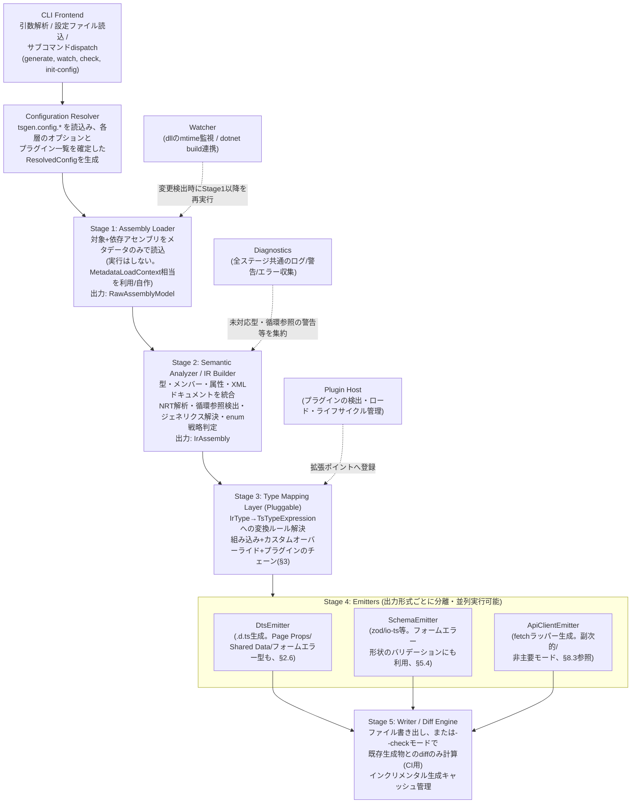
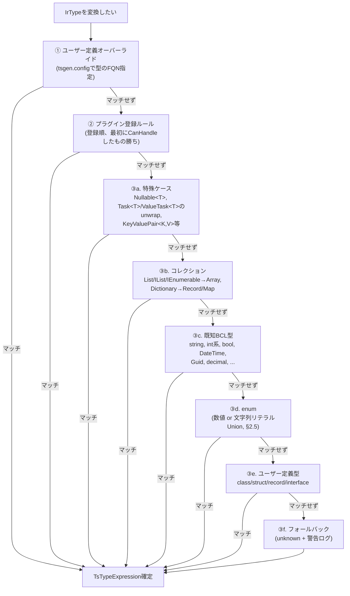
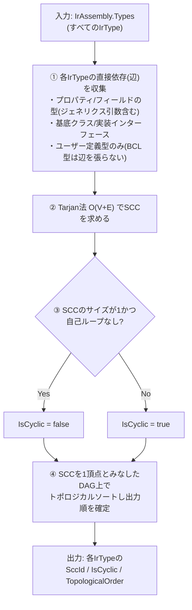
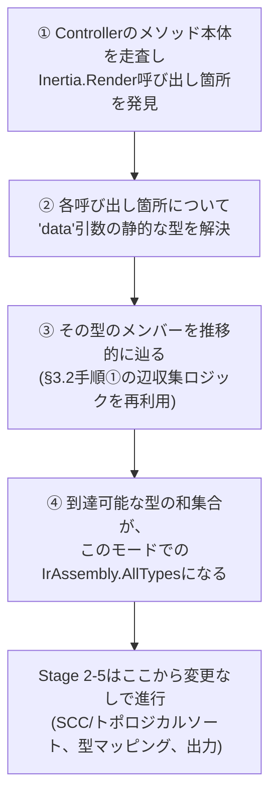
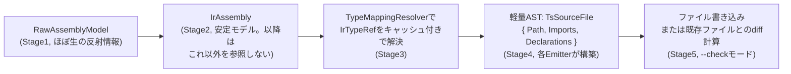

# oxygene-tsgen 設計書 (Phase 1)

> 🇬🇧 [English version](./DESIGN.md)

**ステータス**: 設計フェーズ完了。実装 (Phase 2) 未着手。
**対象**: 最大構成 (フルスコープ) の設計。MVP範囲は本書末尾で明示する。
**実装言語**: Oxygene (RemObjects Elements, `.NET` ターゲット = **Echoes** バックエンド)。

このドキュメントは「なぜこの設計にしたか」を必ず併記する。理由の記述を省略した箇所はない
(不明な場合は「未決定・要検証」として明記している)。判断に迷った箇所の詳細は
`HANDOFF.md` に整理してあるので、Phase 2 着手時は本書と合わせて読むこと。

---

## 0. 目的とスコープ

### 0.1 目的

.NET アセンブリ (`*.dll`) を `System.Reflection` (相当) で読み込み、TypeScript の型定義を
生成する CLI ツール。**`HANDOFF.md` §6 に記載した設計方針転換 (ピボット) 以降、主な用途は
ASP.NET Core + Inertia.js 構成のアプリケーションにおける、Inertia.js ページコンポーネント
向け TypeScript Props型の生成である**: Controller が `Inertia.Render(componentName, data)`
で返す `data` の型を、対応するフロントエンド側ページコンポーネント (例:
`resources/js/Pages/PageName.tsx`) が受け取る Props型として生成すること、それに加えて
全ページ共通で注入される「共有データ (Shared Data)」とのマージ、および Inertia の
`useForm()` クライアントフックが要求するフィールド単位のバリデーションエラー型の生成を
主眼とする。

これは、本ツールの当初のより汎用的な位置づけ (「任意の.NETアセンブリ→任意の
TypeScript出力」) からのスコープ絞り込みである。ただし基盤となる仕組み (型マッピング層、
IR、NRT解析、循環参照検出) は引き続き汎用のままであり、Inertia.js を使わないプロジェクト
向けの、汎用的な .NET → TypeScript 型定義生成 (任意でランタイム検証スキーマ zod/io-ts や
API クライアントの fetch ラッパーを含む) としても引き続き機能する。具体的なユースケースは
§0.2、Inertia向けモードと汎用モードの関係は §8 を参照。

### 0.2 想定ユースケース

**主 (Inertia.js):**

- ASP.NET Core の Controller アクションが `Inertia.Render(componentName, data)` で
  レンダリングする Inertia.js ページコンポーネントの Props型を、フロントエンド側で
  手動で二重管理して知らぬ間にドリフトさせるのではなく、Controller コードから直接
  自動生成する。
- Inertia ミドルウェアの `share()` 相当の機構で全ページに注入される「共有データ」
  (現在の認証ユーザー、フラッシュメッセージ等) を、各ページ固有の Props と統合した
  単一の一貫した Props型にマージする (§2.6, §8.2)。
- Inertia の `useForm()` クライアントフックが要求する、フィールド名→エラーメッセージの
  型を .NET側のバリデーション属性 (`[Required]` 等) から直接生成し、フロントエンド側の
  フォームエラー処理をバックエンドのバリデーションルールと手動同期させずに済むようにする
  (§5.4)。

**副 (汎用 .NET → TypeScript、引き続きサポート、§8.3参照):**

- Inertia.js を使わないプロジェクトも含め、より一般的に ASP.NET Core などの .NET
  バックエンドの DTO/エンティティ定義を単一の真実源とし、フロントエンド
  (TypeScript/React/Vue 等) の型を自動生成してドリフトを防ぐ。
- OpenAPI をすでに生成しているプロジェクトで、型情報をより正確に (ジェネリクス・
  nullable・enum など) TypeScript に反映したい場合の代替/補完。
- 社内 SDK として .NET ライブラリを配布しつつ、TypeScript 版クライアントも自動生成したい
  場合。

### 0.3 非目標 (Non-Goals)

- .NET → TypeScript の「トランスパイル」(ロジック/実行コードの変換) は行わない。
  対象はあくまで型・シグネチャ・メタデータであり、メソッド本体は生成しない
  (API 関数のみ、HTTP 呼び出しラッパーとして生成する。詳細は §8.3)。
- 全ての .NET 型システムの機能を網羅することは目指さない (例: 任意の deep な
  リフレクションのみで表現される動的型、`dynamic`、リフレクション専用の内部型など)。
  未対応の型は明示的に `unknown`/`any` にフォールバックし、警告を出す方針とする
  (詳細は §2.4)。
- C#の制御フローや任意の式評価を完全にモデル化することは目指さない。Inertia.js
  ユースケース向けに導入するエントリポイント駆動解析 (§3.5) は、Controller の
  アクション本体から `Inertia.Render(...)` の呼び出し箇所を見つけ、そこで渡される
  `data` 引数の静的な型を特定できれば十分であり、任意のビジネスロジックを解釈しよう
  とはしない。この限定的なメソッド本体解析ですら、Oxygene製のCLIから実現可能かどうかは
  未検証であり、新たな技術的リスクとして §3.5 に明記する。

---

## 1. アーキテクチャ全体図

### 1.1 コンポーネント分割



補助コンポーネント (上記パイプラインの外側):

- **Watcher**: ファイルシステム監視 (対象 .dll の mtime、または `dotnet build` 連携)
  → 変更検出時に Stage 1 以降を再実行。
- **Plugin Host**: プラグインの検出・ロード・ライフサイクル管理 (§6)。
- **Diagnostics**: 全ステージ共通のログ/警告/エラー収集 (未対応型のフォールバック、
  循環参照の警告などを一元的に集約し、CLI 終了時にサマリ表示)。

**補足 (ピボット後、`HANDOFF.md` §6参照)**: Inertia.jsプロジェクト向けの主要な出力である
Page Props / Shared Data / フォームエラー型は、既存の `DtsEmitter` がそのまま通常の
`.d.ts` として出力する。新規の Stage 4 コンポーネントは不要で、新しいのは Stage 3 手前の
追加IR入力 (§7.1) と解決ロジック (§2.6, §3.5) のみである。一方 `ApiClientEmitter` の
fetchラッパー生成は、パイプラインの主要出力から副次的/任意モード (§8.3) へ格下げされる。

### 1.2 設計判断: なぜ5段階パイプライン+IRを挟むのか

- **理由1 (関心の分離)**: 「.NET のメタデータをどう読むか」と「TypeScript として
  どう表現するか」を混ぜると、リフレクション API の癖 (Oxygene 側の
  `System.Reflection` 互換実装の制約、§4 参照) が出力ロジック全体に染み出し、
  保守性が悪化する。IR を挟むことで、Stage 1/2 の変更 (例: 将来 Roslyn 経由の
  ソース解析を追加する等) が Stage 3/4 に影響しないようにする。
- **理由2 (テスト容易性)**: IR は素朴なデータ構造 (POCO/レコード) なので、
  Stage 3/4 のユニットテストは実アセンブリなしで IR を手組みして実行できる。
  実アセンブリ読み込みが絡む Stage 1/2 のテストと分離できる。
- **理由3 (複数出力形式への対応)**: `.d.ts` / zod スキーマ / API クライアントという
  3種の出力 (§0.2, §7) はいずれも「型が何であるか」という同じ情報を必要とするため、
  共通の IR から分岐させるのが自然。IR がなければ同じ解析ロジック
  (NRT解析、循環参照検出等) を出力形式ごとに重複実装することになる。
- **代替案として検討したもの**: 「Loader が直接 TS AST を組み立てる 2段階パイプライン」
  も検討したが、上記の理由で却下。小規模な CLI ツールとしてはオーバーエンジニアリング
  という意見もあり得るため、MVP (§8) では Stage 2 の一部 (NRT解析等) を簡略化した
  「軽量 IR」から始め、フルスコープの解析は段階的に追加する方針とする。

---

## 2. 型マッピング層の抽象化設計

### 2.1 基本構造

```oxygene
type
  // TypeScript側の型表現。AST寄りだが出力に必要な最小限の情報のみ持つ。
  TsTypeExpression = public class
  public
    Kind: TsTypeKind; // Primitive, Reference, Array, Tuple, Union, Generic, Literal, Function, ...
    Name: String;               // Reference/Generic の場合の型名 (例: "Array", "MyNamespace.Foo")
    TypeArguments: List<TsTypeExpression>; // ジェネリクス実引数
    ElementType: TsTypeExpression;         // Array/Nullable Union の要素型
    UnionMembers: List<TsTypeExpression>;  // Union (nullable は `T | null` として表現)
    LiteralValues: List<String>;           // 文字列リテラルUnion (enum戦略が string の場合)
  end;

  // 型マッピングルール1件の入力/出力契約
  ITypeMappingRule = public interface
    // このルールが IrType を処理できるかどうかを判定する (優先度付きチェーンで使用)
    method CanHandle(aType: IrType; aContext: MappingContext): Boolean;
    // 実際の変換。ネストした型 (ジェネリクス引数等) の解決は
    // aContext.ResolveType() を再帰的に呼び出す (下記2.3参照)
    method Map(aType: IrType; aContext: MappingContext): TsTypeExpression;
  end;
```

### 2.2 ルール解決の優先順位チェーン



### 2.3 拡張可能にする理由と設計

- **なぜ「チェーン+CanHandle」方式か**: 単純な `Dictionary<FQN, TsType>` のマップだと
  ジェネリクスや構造的な型 (タプル、配列の配列等) を表現できない。関数的なルール
  (`CanHandle`/`Map`) にすることで、「名前空間が `MyCompany.*` かつジェネリクスで
  `Result<T,E>` の形をしている型は `Result<T> | Error<E>` に変換する」といった
  構造的なマッチングが可能になる。これはプラグイン機構 (§6) の基盤でもある。
- **`MappingContext.ResolveType()` を再帰の入口にする理由**: 個々のルールが
  「自分の直接の型」だけでなく「ネストした型引数の解決」を毎回自前で書くと
  循環参照検出やキャッシュのロジックが重複する。`MappingContext` が
  訪問済み型のスタック (循環検出用、§3) とキャッシュ (同じ型を何度も解決しない)
  を一元管理し、ルール実装者はそれを意識しなくて良いようにする。
- **優先順位を「最初にCanHandleしたもの勝ち」にした理由**: スコア方式 (最も詳細な
  ルールを自動選択) も検討したが、実装が複雑になり、かつルール間の優先順位が
  暗黙的になり事故りやすい (プラグイン作者から見て「なぜ自分のルールが呼ばれないか」
  が分かりにくい)。明示的なチェーン順序の方がデバッグしやすく、設定ファイルで
  ユーザーが優先順位を上書きできる余地も残せる。

### 2.4 未対応型のフォールバック方針

- 変換できない型は `unknown` として出力し、`Diagnostics` に
  `WARN: cannot map type 'X', falling back to unknown` を記録する。
  CI の `--check --strict` モードではこれをエラー扱いにできるオプションを用意する
  (未対応型が知らぬ間に増えることを防ぐため)。
- **理由**: 生成を止めてしまうと「1つの型が読めないだけで全体が失敗する」という
  体験になり、大規模アセンブリでの採用障壁になる。段階的移行 (MVP → フルスコープ)
  の運用とも相性が良い。

### 2.5 enum 戦略 (数値 or 文字列リテラルUnion)

- 設定でグローバルデフォルト (`numeric` | `stringUnion` | `constObject`) を選び、
  型単位で `[TsEnumStrategy(...)]` 相当のカスタム属性、またはFQN指定の設定で
  上書き可能にする。
- `stringUnion` の場合、`[EnumMember(Value = "...")]` (`System.Runtime.Serialization`)
  や `System.Text.Json` の `[JsonStringEnumConverter]` /
  `[JsonPropertyName]` 相当の情報があればそれを文字列値として優先し、
  なければ C# 側のメンバー名をそのまま文字列値にする。
  - **理由**: JSON シリアライズ時の実際の値と TS 型が乖離すると意味がないため、
    シリアライズ属性を可能な限り信頼できる情報源として扱う。

### 2.6 Inertia.js固有の型生成対象

`HANDOFF.md` §6 に記載したピボットを受けて、上記の型マッピング層の上に3つの追加の
型生成対象が乗る。いずれも末端の型解決は同じ `ITypeMappingRule` チェーン (§2.2) を通す
— 新しいのは個々のメンバー型の変換方法ではなく、各対象型を構成する「メンバーの集合」を
どう組み立てるかという部分である。

1. **Page Props型** — `Inertia.Render(componentName, data)` を呼び出す各Controller
   アクションについて、`data` の形 (通常は匿名型、またはインラインで組み立てられたPOCO)
   が `componentName` に紐付いた `interface`/`type` として生成される (具体的な命名・
   出力ファイル規約は未定 — §7.4と§11の未解決事項を参照)。これにはメソッド本体内での
   当該呼び出し箇所の発見 (§3.5) が必要であり、この部分は新規かつ未検証である。
2. **Shared Data型** — Inertiaミドルウェアの `share()` 相当の機構で全ページに注入される
   データ (現在の認証ユーザー、フラッシュメッセージ等) は、各ページ固有のProps型と
   マージする必要がある。設計上は独立した `IrSharedDataContract` (§7.1) として表現し、
   生成される各Page Props型がこれと構造的に交差型合成する
   (`type PageProps<T> = SharedData & T`) 形にする。共有フィールドを各ページの
   interfaceへ複製しないことで、共有データの内容変更時のドリフトを避ける。
3. **フォーム/`useForm()`エラー型** — Inertiaのクライアント側 `useForm()` フックは、
   バリデーションエラーに対してフィールド名→エラーメッセージの形を要求する。これは
   §5で既に設計済みのバリデーション属性反映 (`[Required]`, `[StringLength]` 等、
   zod/io-tsスキーマ生成 §5.3 向けに設計済み) をそのまま再利用する。新規なのは
   生成する「形」だけであり (`Partial<Record<keyof FormValues, string>>` 的な型)、
   ランタイムスキーマではない。§5.4参照。

これらはいずれも `TsTypeExpression` の形 (§2.1) や優先順位チェーンによる解決の仕組み
(§2.2) を変更するものではない — 追加されるのはあくまで、そもそもどの `IrType` が
解決対象として存在するか、そのメンバーがどうグルーピングされて出力されるかを決める
新しい「入口」である。

---

## 3. 循環参照検出アルゴリズム

### 3.1 問題設定

TypeScript の `interface`/`type` 宣言自体は相互参照可能 (プロパティの遅延評価的な
性質のため、`interface A { b: B } interface B { a: A }` は問題ない)。
一方で問題になるのは:

1. **型引数の無限展開**: ジェネリクスの「構造的展開」を行う設計 (例: `Result<T,E>`
   を毎回インライン展開するような戦略) を採った場合、再帰的なジェネリクス
   (`TreeNode<T>` が `Children: List<TreeNode<T>>` を持つ、など) で無限ループする。
2. **zod/io-ts スキーマ生成**: ランタイム検証スキーマは「値」として定義されるため、
   TypeScript の型と違って遅延参照に工夫が要る (`z.lazy(() => schema)` 等)。
   循環を検出し、該当箇所を `lazy` 化する必要がある。
3. **単一ファイル出力時のトポロジカルソート**: 依存順に型定義を並べたい場合
   (可読性のため。TS的には順不同でも動くが人間が読みやすい方が良い)、循環がある
   グループはまとめて出力する必要がある。

### 3.2 アルゴリズム案

型を頂点、"直接参照" (プロパティ/フィールド/戻り値/引数の型として出現する) を
辺とする有向グラフに対し、**Tarjan の強連結成分分解 (SCC)** を IR構築の後処理
(Stage 2 の最終工程) として1回実行する。



### 3.3 検出結果の使い道 (Emitter側の分岐)

- **DtsEmitter**: `interface`/`type` は循環があってもそのまま出力可能なため、
  基本的に `IsCyclic` を無視できる。ただし「型を構造的にインライン展開する」設定
  (例: タプル的な匿名型展開) を使う場合のみ、循環を検出したら強制的に名前付き型
  として切り出す (展開をやめる) フォールバックを行う。
- **SchemaEmitter (zod)**: `IsCyclic = true` の型は `z.lazy(() => ...)` で包み、
  かつ TypeScript の型注釈 (`z.ZodType<T>`) を明示することで zod の型推論の限界を
  回避する。circular でない型は通常通り即時評価の式で生成し、可読性を優先する。
- **単一ファイル出力**: SCC単位でグループ化して出力順を決定 (§3.2 手順4)。

### 3.4 なぜこの設計か

- Tarjan法を選んだ理由: 循環検出だけなら単純なDFSの「訪問中」フラグでも十分だが、
  「循環しているグループをまとめて扱う」(zodのlazy化やトポロジカル順出力) には
  SCC分解の結果 (グループ単位のまとまり) がそのまま使えるため、最初からSCCベースで
  設計する方が後工程との整合性が良い。DFSベースの単純な検出だと「循環に含まれる
  型集合」を再度別ロジックで求め直す二度手間になる。
- 計算量: O(V+E) で、アセンブリ中の型数が数千規模でも実用上問題にならない想定。
  実測はPhase 2で確認 (大規模アセンブリでのベンチマークをタスクリストに追加、
  HANDOFF.md参照)。

### 3.5 エントリポイント駆動の型発見 (Inertiaモード)

**問題設定**: 上記の §3.1–3.4 は既存のモデル — アセンブリ全体をスキャンして
`IrAssembly.AllTypes` を全型から構築し、その全体から循環を探す — を前提としている。
この前提はInertia.jsユースケースにはあまり合わない。典型的なASP.NET Core +
Inertia.jsのController用アセンブリには、`Inertia.Render` に一度も渡されない型
(内部サービス用DTO、ページに露出しないEF Coreエンティティ等) が多数含まれ、
それら全てに対して `.d.ts`/Props型を生成すると、フロントエンドが必要としない
ノイズが増える。

**提案する方式**: `IrAssembly.AllTypes` をアセンブリ内の全型からシードするのではなく、
エントリポイント駆動モードでは **`Inertia.Render` の呼び出し箇所から到達可能な型のみ**
からシードする:



これは循環参照検出 (§3.2手順①、辺の収集) のために既に構築済みのグラフ走査機構を
そのまま再利用する — 新規なのは手順①/②: **呼び出し箇所の発見と、引数の静的な型の
解決自体** であり、これには型/メンバーのシグネチャだけでなくメソッド本体の検査が
必要になる。

**なぜこれが新規かつ未検証の技術リスクなのか (解決済みとして扱わないこと)**:
本設計書のそれ以外の部分は全て「型レベル」の.NETメタデータ (`System.Reflection`的な、
型・メンバー・属性) を読むものであり、これは比較的よく踏み固められた領域である。
`Inertia.Render(...)` の呼び出し箇所を見つけ、引数として渡される式の静的な型を
特定するには、以下のいずれかが必要になる:

- (a) メソッド本体のIL レベル解析 — `call`/`callvirt`/`newobj` オペコードを辿り、
  オペランドスタックを追跡して引数の形を再構築する。これは容易ではなく、特に
  匿名型 (C#コンパイラが `<>f__AnonymousType0` 的なソースレベルの名前を持たない
  合成クラスへ下げる) では顕著である。または
- (b) このツールの「リフレクションのみ」という設計前提の代わりに (あるいはそれに
  加えて) Roslyn構文木レベルの解析を行う — これは大きなアーキテクチャ上の追加であり、
  §0.1/§1に述べた「メタデータのみ、ソース解析は行わない」という位置づけと
  緊張関係にあるとも言える。

どちらの手法も試作されていない。これはInertiaピボットに関するPhase 2作業に着手する
セッションにとって最優先の技術検証項目としてフラグを立てる (`HANDOFF.md` §6.3、
および §11 の対応する未解決事項も参照)。

**エントリポイント解析が実現不可能だった場合のフォールバック**: アセンブリ全体
スキャンモード (§3.1–3.4、変更なし) は引き続きフォールバックとして利用可能である
— ツールが呼び出し箇所から自動発見する代わりに、どのPOCOがInertiaページの裏付けと
なっているかをユーザーに明示的にマーキングしてもらう (マーカー属性、または
component名→型FQNの対応リストを設定ファイルに明示する等) という代替案も考えられる。
これはエントリポイント発見の最大の売りである「自動で手動注釈不要」という利便性を
犠牲にするが、それ以外のパイプライン (§2–§10) は無改造のまま動作する。自動発見と
明示的注釈のどちらを実際のMVPパスとするかは、上記の技術検証待ちとして未決定のまま
残す。

---

## 4. NRT (Nullable Reference Types) 解析方針

### 4.1 調査結果のサマリ (Web調査ベース)

このセクションは Web 検索ツールを用いて調査した内容と、調査で確認できなかった
(=未検証・要実機検証) 部分を明確に分けて記載する。

**確認できたこと:**

- C# の Nullable Reference Types (NRT) は言語機能であり、CLR自体には
  nullability の概念がない。Roslyn (C#コンパイラ) は `?`/非`?` の情報を
  `System.Runtime.CompilerServices.NullableAttribute` (メンバー単位、
  `byte` または `byte[]` フラグ) と `NullableContextAttribute`
  (型/モジュール単位のデフォルト文脈) という、どちらも**標準の .NET カスタム属性**
  としてIL メタデータに埋め込む。値は `0=Unknown, 1=NotNullable, 2=Nullable`
  ([出典: Roslyn nullable-metadata docs, Rico Suter氏のブログ等])。
- これは **C#コンパイラ (Roslyn) 固有の出力規約** であり、CLR/BCL 標準の
  一部ではない。つまり「読む側」は `System.Reflection` の標準APIだけでなく、
  この特定のカスタム属性を認識してデコードするロジックを自前で書く必要がある
  (Roslynの `NullableAnnotation` 相当の情報は `System.Reflection` の
  標準プロパティとしては公開されていない)。
- Oxygene (Elements) は `.NET` ターゲットに **Echoes** という専用バックエンドを
  使用し、C#/VBコンパイラと同様に標準IL/メタデータを出力する
  (RemObjects公式: 「Microsoft の Visual C#/VB コンパイラと同様にIL codeへ
  コンパイルされ、CLRが動く場所ならどこでも動く」との説明あり)。
  標準IL出力である以上、`CustomAttributeData` としてのカスタム属性一般は
  `System.Reflection` 互換APIから読めるはずである。
- Oxygene 言語自体は `nullable T` / `not nullable T` という明示的なキーワードで
  nullability を表現する (C#の `T?`/`T!` に相当する Elements 統一構文の一種、
  RemObjects公式ドキュメント「Nullability」「Oxygene/Types/Nullability」による)。
  デフォルトは「参照型は nullable、値型は non-nullable」で C# と同じ考え方。

**確認できなかったこと (要実機検証、リスクとして明記):**

- Oxygene (Echoes バックエンド) が `nullable`/`not nullable` 修飾を実際に
  **`NullableAttribute`/`NullableContextAttribute` としてIL出力するかどうか**は、
  公式ドキュメント (docs.elementscompiler.com の Nullability 関連ページ) を
  調査した範囲では明記されていなかった。これは「Oxygeneで書かれたアセンブリを
  C#の慣習でNRT情報を読もうとしたときに実際に読めるか」を左右する最重要な
  未確認事項である。
- 仮に Oxygene が独自の属性 (例: `RemObjects.Elements.*Nullable*`) を使っている
  場合、本ツールはそちらも解釈できるようにする必要があるが、現時点でその属性の
  有無・名前は不明。

### 4.2 設計方針 (上記の不確実性を前提にした設計)

不確実性がある以上、**「NRT情報ソースを差し替え可能なプラガブルな抽象」**として
設計し、Phase 2 の最初期タスクとして実機検証 (§9, HANDOFF.md) を行い、
検証結果に応じて実装を確定する。

```oxygene
type
  // NRT解析結果。Emitter/型マッピング層はこれだけを見る。
  NullabilityInfo = public class
  public
    State: NullabilityState; // Unknown, NotNullable, Nullable
    Source: NullabilitySource; // どの情報源から判定したか (診断・デバッグ用)
  end;

  NullabilitySource = public enum (
    ExplicitAttribute,      // NullableAttribute等を直接発見
    ContextAttribute,       // NullableContextAttributeからの継承
    ValueTypeDefault,       // 値型のデフォルト規則から推定
    NoInformation           // 何も情報がなく Unknown 扱い
  );

  // 差し替え可能なNRT情報プロバイダ。複数登録可能で、優先順に最初に
  // Unknown以外を返したものを採用する (型マッピングのCanHandleチェーンと同じ思想)。
  INullabilityProvider = public interface
    method TryGetNullability(aMember: IrMemberRef; aContext: AnalysisContext): NullabilityInfo;
  end;
```

- **組み込みプロバイダ1: `RoslynStyleAttributeProvider`**: 標準の
  `NullableAttribute`/`NullableContextAttribute` を解釈する (C#/VBが生成する
  アセンブリ、および Echoes が同じ規約に従っている場合の Oxygene アセンブリの
  両方をカバーできる想定)。
- **組み込みプロバイダ2: `ValueTypeDefaultProvider`**: 属性が全く無い場合の
  フォールバックとして、値型は non-nullable、参照型は「情報無し=Unknown」とする
  保守的な規則 (Unknown は `.d.ts` では `T | null | undefined` 的に安全側へ倒すか、
  設定で「Unknown時は non-null 扱い」にするかを選べるようにする)。
- **拡張ポイント**: Phase 2 の実機検証で Oxygene 独自の属性が見つかった場合、
  `OxygeneNativeNullabilityProvider` を追加するだけで済むように、
  この抽象を最初から用意しておく。

### 4.3 なぜこの設計か

- 「不確実な外部要因 (コンパイラのメタデータ出力仕様) に依存する解析ロジックは、
  差し替え可能なプロバイダとして切り出す」という原則に基づく。もし
  `RoslynStyleAttributeProvider` だけをハードコードして実装し、後から
  Oxygene が別の属性を使っていると判明した場合、解析ロジック全体を書き直す
  リスクがある。プロバイダチェーンにしておけば追加のみで対応できる。
- Unknown 状態を明示的に第一級で扱う理由: 「わからない」を握りつぶして
  勝手に non-null と判定すると、実行時に null が来てランタイムエラーになる
  TypeScript コードを生成してしまう (安全性の欠如)。逆に全部 nullable
  扱いにすると型の有用性が下がる。ユーザーが `--nrt-unknown-policy`
  (仮称: `assume-nullable` | `assume-non-nullable` | `mark-unknown`) を選べる
  ようにし、暗黙の安全性判断をツールが勝手に行わないようにする。

---

## 5. メタデータ・属性反映

### 5.1 対応する属性・情報源

| 情報源 | 反映先 | 備考 |
|---|---|---|
| `System.Text.Json.Serialization.JsonPropertyName` | プロパティ名変換 | 最優先。無ければ `JsonNamingPolicy` 設定 (camelCase等) をシミュレートして命名規則変換 |
| `System.Text.Json.Serialization.JsonIgnore` | プロパティ除外 | `Condition` (WhenWritingNull等) は簡易対応、詳細はPhase 2で仕様確定 |
| XML Doc コメント (`///`, Oxygene側は `///` または `{{ }}` 相当の構文を要調査) | JSDoc (`/** ... */`) | アセンブリ横に生成される `.xml` ドキュメントファイルをMSBuild同様の慣習で探索して読み込む |
| `System.ObsoleteAttribute` | `@deprecated` JSDocタグ | `Message`/`IsError` も反映 |
| `System.ComponentModel.DataAnnotations.*` (`Required`, `StringLength`, `Range`, `RegularExpression`等) | zod/io-tsスキーマの制約 | §5.3 |
| `[EnumMember]` / `[JsonStringEnumConverter]` | enum文字列リテラル値 | §2.5 |

### 5.2 XML ドキュメントコメント統合の設計

- .NET の標準的な `AssemblyName.xml` (MSBuildが `<GenerateDocumentationFile>` で
  生成するもの) を、アセンブリ本体と同じディレクトリから探索して読み込む
  (見つからない場合は警告のみでスキップ、必須にはしない)。
- XMLの `<member name="...">` の `name` 属性 (例: `M:Namespace.Type.Method(System.String)`)
  から IR 内の該当メンバーへの解決テーブルを Stage 2 で構築する。
  **理由**: リフレクションメタデータには無いドキュメント文字列を紐付ける唯一の
  標準的な方法であり、C#/Oxygene問わず共通のXML形式であるため言語非依存に扱える。
- `<summary>` → JSDoc本文、`<param>` → `@param`、`<returns>` → `@returns`、
  `<exception>` → `@throws` の対応表をテンプレート化する。
- Oxygene側のドキュメントコメント構文がXML docコメントとして同一形式で
  出力されるかは要確認 (Phase 2着手時の確認事項としてHANDOFF.mdに記載)。

### 5.3 バリデーション属性 → zod/io-ts スキーマ

- `SchemaEmitter` は「バックエンド (zod / io-ts / 将来的にvalibot等)」を
  プラグイン的に切り替え可能にする (§6と同じプラグイン機構を再利用)。
- マッピング例:
  - `[Required]` → optional から必須へ (nullable/NRT解析結果と統合して判定)
  - `[StringLength(max, MinimumLength = min)]` → `z.string().min(min).max(max)`
  - `[Range(min, max)]` → `z.number().min(min).max(max)`
  - `[RegularExpression(pattern)]` → `z.string().regex(new RegExp(pattern))`
- **理由 (なぜ型定義と分離した別Emitterか)**: `.d.ts` は型情報のみで実行時コストが
  ゼロだが、zod等のスキーマは実行時に評価される値である。両者は「同じIRから
  生成されるが性質の異なる成果物」であるため、Stage 4 で別Emitterとして
  完全に分離し、`.d.ts` のみが必要なユーザーはSchemaEmitterを無効化して
  ビルドコストを避けられるようにする。

### 5.4 バリデーション属性 → Inertiaフォームエラー形状

§2.6 (項目3) で導入した `useForm()` 向けの型対象は、§5.3のzod/io-tsスキーマ生成向けに
既に設計済みの `System.ComponentModel.DataAnnotations.*` 反映ロジックをそのまま再利用する
— 新規の属性読み取りロジックは不要である。新規なのは生成する「形」だけであり、
ランタイム検証されるzodスキーマの代わりに (あるいはそれに加えて)、単純な
`Partial<Record<'field1' | 'field2' | ..., string>>` 形式のTypeScript型を生成する
(フィールド名は対応するPage Props型 (§2.6項目1) と同じPOCO/匿名型のメンバー発見結果を
利用する)。これはInertiaのクライアント側 `useForm<TFormErrors>()` 相当フックの
ジェネリック引数として利用されることを想定する。

このジェネリック引数の具体的な形はアダプタ・フロントエンドフレームワークに依存するため
(§11のアダプタ/フレームワーク選定に関する未解決事項)、この対象が生成すべき正確な
TypeScriptシグネチャ (素朴な `Record<...>` 型か、選定したInertia React/Vue/Svelte
アダプタの型定義により即した形か) は、それらの選定が済むまで未決定のままとする。

---

## 6. プラグイン機構のインターフェース設計

### 6.1 拡張ポイント一覧

1. `ITypeMappingRule` (§2) — 型変換ルールの追加
2. `INullabilityProvider` (§4) — NRT情報ソースの追加
3. `INamingStrategy` — プロパティ/型名の命名規則変換 (camelCase化等) の差し替え
4. `ISchemaBackend` — zod/io-ts等、スキーマ生成の出力方言の差し替え
5. `IEmitterExtension` — 出力ファイルへの前後処理フック (例: 生成物へのヘッダー
   コメント挿入、Prettier等のフォーマッタ連携)

### 6.2 プラグインパッケージの形

```oxygene
type
  // プラグインのエントリポイント。1プラグイン = 1個以上の拡張ポイント実装を登録する。
  ITsgenPlugin = public interface
    method GetName: String;
    method GetVersion: String;
    method Register(aRegistry: IExtensionRegistry);
  end;

  IExtensionRegistry = public interface
    method AddTypeMappingRule(aRule: ITypeMappingRule; aPriority: Int32 := 0);
    method AddNullabilityProvider(aProvider: INullabilityProvider; aPriority: Int32 := 0);
    method AddNamingStrategy(aName: String; aStrategy: INamingStrategy);
    method AddSchemaBackend(aName: String; aBackend: ISchemaBackend);
    method AddEmitterExtension(aExtension: IEmitterExtension);
  end;
```

### 6.3 プラグインの配布・ロード方式 (候補比較、未確定)

| 方式 | 長所 | 短所 |
|---|---|---|
| A. 同一.NETランタイム上の別アセンブリを動的ロード (Assembly.Load) | ネイティブに近い実行速度、型安全なインターフェース実装 | プラグイン側もOxygene/.NET言語で書く必要があり裾野が狭い。CLIツール自体の配布形態(AOT化するか等)に制約される可能性 |
| B. 設定ファイル (JSON/YAML) 上の宣言的ルール (属性名→TS型のマッピング表など) | 言語非依存、学習コストが低い、大半のカスタマイズ要求はこれで足りる | 「構造的な」複雑なルール (§2.3のような) は表現しにくい |
| C. 外部プロセス (別言語で書かれたプラグイン) とのプロトコル通信 (stdin/stdout JSON等) | 言語非依存で拡張性最大 | 実装コストが高く、パフォーマンスオーバーヘッドがある |

**方針**: B (宣言的ルール) をまず用意し、大半のユースケース (型オーバーライド、
命名規則、除外設定) をカバーする。A (アセンブリ動的ロード) はより高度な
拡張が必要になった場合の上位互換として `ITsgenPlugin` インターフェースを
用意しておくが、実装優先度はMVP後 (§8 Phase 2後半) とする。C は現時点では
スコープ外 (需要が明確になってから検討)。

- **理由**: プラグイン機構は「使われて初めて価値が出る」ものであり、複雑な
  動的ロード機構を先に作り込んでも、実際のカスタマイズ要求の8割は
  「この型はこう変換してほしい」「この命名規則を使いたい」という宣言的な
  ものである可能性が高い (一般的なコード生成ツール, 例: TypeGen, NSwag,
  OpenAPI Generator 等の実運用パターンからの類推)。まず設定ファイルベースで
  ニーズを満たし、本当に構造的な拡張が要る利用者向けにインターフェース
  (A方式) を後から生やす、という段階的releaseにする。

---

## 7. 出力生成パイプラインのデータ構造案

### 7.1 IR (中間表現) の主要構造

```oxygene
type
  IrAssembly = public class
  public
    Name: String;
    Modules: List<IrNamespaceModule>; // 名前空間ごとにグルーピング済み
    AllTypes: List<IrType>;           // フラットなリスト (SCC解析等で使用)
  end;

  IrNamespaceModule = public class
  public
    NamespaceName: String;   // 例: "MyCompany.Models"
    Types: List<IrType>;
    // 出力構成(§7.3)決定後にここに OutputFilePath が確定する (Stage 4で設定)
  end;

  IrType = public class
  public
    FullName: String;
    Kind: IrTypeKind; // Class, Interface, Struct, Enum, Record, DelegateAsFunction, Tuple
    BaseType: IrTypeRef;
    Interfaces: List<IrTypeRef>;
    GenericParameters: List<IrGenericParam>;
    Members: List<IrMember>;
    Attributes: List<IrAttribute>;   // 反映対象属性のみ保持 (§5.1)
    XmlDoc: XmlDocInfo;
    SccId: Int32;                    // §3
    IsCyclic: Boolean;               // §3
  end;

  IrMember = public class
  public
    Kind: IrMemberKind; // Property, Field, Method, EnumValue
    Name: String;
    JsonName: String;                // §5.1 適用後の最終プロパティ名
    ValueType: IrTypeRef;
    Nullability: NullabilityInfo;    // §4
    Attributes: List<IrAttribute>;
    XmlDoc: XmlDocInfo;
    IsIgnored: Boolean;              // [JsonIgnore]等
  end;

  IrTypeRef = public class
  public
    // 未解決の型参照 (ジェネリクス引数を含む可能性がある)。
    // MappingContext.ResolveType() を通して TsTypeExpression に変換される。
    ResolvedType: IrType;            // BCL外のユーザー定義型ならここに解決結果
    WellKnownKind: WellKnownTypeKind; // string/int/List<T>等、BCLの既知型ならこちら
    TypeArguments: List<IrTypeRef>;
  end;

  // --- Inertia固有のIR追加 (§2.6)。エントリポイント駆動解析モード (§3.5)
  // 使用時のみ利用される ---

  IrPageComponent = public class
  public
    ComponentName: String;           // 例: "Users/Show" (resources/js/Pages からの相対パス。具体的な規約は未定、§7.4)
    PropsType: IrTypeRef;            // Inertia.Render に渡された 'data' 引数の型
    SourceControllerAction: String;  // Controllerメソッドの FQN (診断・トレーサビリティ用)
  end;

  IrSharedDataContract = public class
  public
    Members: List<IrMember>;         // 例: 認証ユーザー、フラッシュメッセージ。各IrPageComponentのPropsにマージされる (§2.6項目2)
  end;

  IrFormErrorShape = public class
  public
    SourceType: IrTypeRef;           // バリデーション属性を読み取った元のPOCO/匿名型
    FieldNames: List<String>;        // Record<...>のキー共用体になるフィールド名 (§5.4)
  end;
```

### 7.2 各ステージのデータフロー



**設計判断: Stage1のRawAssemblyModelとStage2のIrAssemblyをなぜ分けるか**
Oxygeneの `System.Reflection` 互換層の挙動 (§4.1で判明した通り、一部の
挙動が未検証) に将来変更が入っても、Stage2以降 (パイプラインの大部分) を
書き直さずに済むようにするため。Stage1は「.NETメタデータの生の姿を
IrAssemblyが要求する形に整形するだけ」の薄い層に留める。

### 7.3 出力構成の設計

- **名前空間 → ESモジュール階層**: デフォルトでは `MyCompany.Models.User`
  → `mycompany/models/user.d.ts` のようにディレクトリ階層へ1:1マッピングする
  設定 (`namespaceStrategy: "directory"`) と、名前空間ごとに1ファイル
  (`namespaceStrategy: "flat-per-namespace"`)、全体を1ファイルにまとめる
  (`namespaceStrategy: "single-file"`) の3種を切り替え可能にする。
  - **理由**: 小規模プロジェクトは単一ファイルの方が扱いやすく、大規模プロジェクト
    (数百型規模) はディレクトリ階層の方がIDEでの探索性・差分レビュー性が良い。
    どちらが正解ということはないため設定で選ばせる。
- **カスタム型オーバーライド設定**: `tsgen.config` に
  `typeOverrides: { "System.Guid": "string", "MyCompany.Money": { module: "./custom-types", name: "Money" } }`
  のような宣言的マッピングを許可し、これは §2.2 の優先順位チェーンの
  最上位 (ユーザー定義オーバーライド) として解決される。

### 7.4 Inertia固有対象の出力構成 (未決定)

生成した Page Props / Shared Data / フォームエラー型 (§2.6) をフロントエンド
プロジェクトのどこに配置すべきか — 単一の `resources/js/types/inertia.d.ts` か、
`resources/js/Pages/**` の構成をミラーしたページごとのファイルか (上記§7.3の
`namespaceStrategy` の選択肢と同様) — はまだ決めていない。これはまだ未決定の
フロントエンドフレームワーク選定 (§11) に依存するためである: Reactを前提とした
構成であれば、ページコンポーネント1つにつき生成 `.d.ts` を1つ対応させるのが自然だが、
Vueの `defineProps<...>()` 志向の構成であれば、アンビエントなグローバル宣言としてでは
なく、使用箇所に直接型をインラインする方が好まれるかもしれない。ここでは規定せず、
明示的な未解決事項 (§11) として残す。

---

## 8. サーバー ↔ フロントエンド データ連携設計

### 8.1 判断: Inertia.js連携を主とし、汎用REST/OpenAPI連携を副次的な位置づけに畳み込む

`HANDOFF.md` §6のピボットを受けて、本セクションの元の設計 (OpenAPI仕様との統合モード、
およびエンドポイント単位のfetchラッパー生成) はもはや本ツールの主要ユースケースではない。
この元の内容をどう扱うか、3つの選択肢を検討した:

| 選択肢 | 内容 | 評価 |
|---|---|---|
| A. OpenAPI/fetchラッパー設計を完全に廃止する | 該当内容をそのまま削除し、今後スコープ外とする | 却下: 実際のInertia.jsアプリケーションは、Inertiaでレンダリングするページと並行して、少数の素のJSON APIエンドポイント (例: ページ遷移を伴わないクライアント側JSからのオートコンプリート/検索エンドポイント) を持つことが多い。この設計を捨てると、既に設計済みの有用な機能を何の利益もなく失うことになる |
| B. Inertia連携と完全に並列な、同格の主要モードとして維持する | 両方の設計を同じ重み・同じ実装優先度で維持する | 却下: これはまさにピボットがMVPのシンプルさのために避けようとしている「2つの並列モードを維持する」という結果そのものである (`HANDOFF.md` §6.4)。対象プロジェクトの大半はInertia中心の構成になると見込まれるため、REST/OpenAPIパスを同格の主要扱いにするのは、実際の想定利用度を過大評価することになる |
| **C. 副次的・低優先度のモードとして畳み込む (採用)** | 既存のOpenAPI統合・fetchラッパー設計 (以下§8.3にそのまま保存) は利用可能・機能するまま残すが、§8.2のInertia固有連携に対して、ドキュメント上の重み付けとMVP/実装順序 (§10) の両方で明示的に優先度を下げる | **採用。** これは `HANDOFF.md` §6.4 の傾き ("当面Inertia向けに一本化する方がMVPとしてはシンプル") と整合しつつ、上記の「Inertiaページと並行する少数の素のJSONエンドポイント」というケースで引き続き有用な設計を捨てずに済む |

**判断メモ (レビュー用にフラグ立て)**: この畳み込みの判断は `HANDOFF.md` §6.4 の
明示的な傾きに従ったものである。却下した代替案 (2つの完全並列・同格設計を維持する) は、
まさにMVPのシンプルさのために避けるべきものとして同箇所で指摘されていたためである。
この判断自体はアダプタやフロントエンドフレームワークの選定 (§11、未解決) を決めるもの
ではない — §8.3が主か副かという判断とは独立している。

### 8.2 Inertia.js Page Props & Shared Data連携 (主)

- **Page Props** (§2.6項目1, `IrPageComponent`, §7.1): `Inertia.Render(componentName,
  data)` 呼び出し箇所のエントリポイント駆動発見 (§3.5) から生成する。出力は
  componentName → Props型の対応であり、`DtsEmitter` が通常の `.d.ts`
  `interface`/`type` 宣言として出力する (新規のStage 4コンポーネントは不要 — §1.1の
  補足を参照)。
- **Shared Data** (§2.6項目2, `IrSharedDataContract`, §7.1): ASP.NET CoreのInertia
  ミドルウェアの `share()` 相当の登録から発見する。この登録箇所を対象アセンブリ/
  コードベースから確実に特定する「方法」自体が未解決であり (通常、型や属性ではなく
  `Startup`/`Program` の設定コード内の呼び出しである)、どのアダプタを選ぶか (§11) に
  依存する — アダプタによっては、共有データの登録をよりリフレクション可能な形
  (例: 既知のインターフェースを実装するクラス) で公開している場合があり、これも
  アダプタ選定 (§11) を先に済ませるべき理由の一つである。
- 両者は§2.6項目2の `SharedData & PageProps` 交差型戦略でマージされる。
- フォーム/`useForm()`エラー型は§5.4で別途扱う (これは§5の既存バリデーション属性反映を
  再利用するものであり、新規の発見ロジックではない)。

### 8.3 汎用REST/OpenAPI連携 (副次的・優先度低)

本サブセクションはピボット前の設計をそのまま保存したものであり、本ツールの主要出力
(上記§8.1) ではなく、任意の副次的モードとして位置づけ直したものである。

#### 8.3.1 OpenAPI仕様生成との統合

- 本ツールはOpenAPI仕様そのものは生成しない (ASP.NET Core側の
  `Microsoft.AspNetCore.OpenApi` / Swashbuckle 等、既存エコシステムに委ねる)。
  代わりに **「既存のOpenAPI JSON/YAMLを読み込み、型はそちらではなく
  本ツールが .NET アセンブリから生成した高精度な型に差し替える」**
  統合モードを用意する。
  - **理由**: OpenAPI (特にSwashbuckleの既定出力) はnullableやジェネリクスの
    表現力がTypeScriptほど高くなく、enumも文字列止まりになりがちなため、
    アセンブリから直接読む方が正確な型が得られる。一方でOpenAPIにはHTTPメソッド・
    パス・パラメータ位置(query/path/body)という、リフレクションだけでは
    (素朴には) 得られない情報がある。両者を組み合わせるのが最も実用的。
- 統合手順 (案): OpenAPI の `operationId` や `x-*` 拡張フィールドに .NET側の
  コントローラ/アクションのFQNを埋め込む慣習を前提とし (ASP.NET Core既定では
  `operationId` は自動生成されるため、埋め込みには
  `[EndpointName]`/カスタム属性、またはSwashbuckle設定側での工夫が必要になる
  可能性がある。要Phase 2調査)、その紐付けを使って型を差し替える。

#### 8.3.2 エンドポイント単位のTypeScript関数 (fetchラッパー) 生成

```typescript
// 生成イメージ (ApiClientEmitter出力例)
export async function getUserById(
  id: string,
  options?: { signal?: AbortSignal; baseUrl?: string },
): Promise<User> {
  const res = await fetch(`${options?.baseUrl ?? ""}/api/users/${id}`, {
    signal: options?.signal,
  });
  if (!res.ok) throw new ApiError(res.status, await res.text());
  return (await res.json()) as User;
}
```

- HTTPクライアント実装は `fetch` 標準APIを既定とし、Axios等への差し替えは
  §6のプラグイン機構 (`IEmitterExtension` またはテンプレート差し替え) で
  対応する方針とする (fetchはNode.js 18+/ブラウザ双方で標準なので依存ゼロで
  動くことを優先)。
- レスポンスの実行時検証 (zod等) をここに挟むかはオプション化する
  (`apiClient.validateResponse: boolean`)。検証を有効にする場合は
  §5.3のSchemaEmitterの出力を利用する。

---

## 9. 開発体験 / CI 設計

### 9.1 インクリメンタル生成

- 入力ハッシュ (対象アセンブリのファイルハッシュ + 設定ファイルのハッシュ +
  ツール自体のバージョン) をキーに、Stage 1-4 の結果をキャッシュする。
  キャッシュヒット時はStage 5 (書き込み) のみ実行、もしくは書き込みすら
  スキップ (出力先の内容と一致していれば)。
- **理由**: watch モードでの再生成速度、および大規模アセンブリでのCLI体験
  向上のため。キャッシュは `.tsgen-cache/` 的なディレクトリに置き、
  `.gitignore` 対象とする想定。

### 9.2 Watch モード

- 対象アセンブリファイルのファイルシステム監視 (mtime/ハッシュベースの
  ポーリング、またはOS通知APIが使えるならそちらを優先)。
- .NET側のビルド (`dotnet build`) の完了を検知して再生成する運用を想定するため、
  「ファイル変更検知後、一定時間 (デバウンス、既定500ms程度) 待ってから
  再読み込みする」設計とする (ビルド中の中間状態のdllを読みに行って失敗する
  ことを避けるため)。

### 9.3 CI差分チェック (`--check` モード)

- 生成物をリポジトリにコミットする運用のプロジェクト向けに、
  「実際に生成し、既存のコミット済みファイルと完全一致するか」を検証し、
  不一致ならnon-zero終了 + diff表示するモードを用意する。
- **設計判断: なぜ生成→比較方式で、ハッシュだけの比較にしないか**:
  ハッシュ不一致だけだと「なぜ不一致か」がCIログから分からず開発者体験が悪い。
  実際にdiffを出すことで、CI上でも「どのプロパティ/型が変わったか」が
  一目でわかるようにする (Stage5のDiff Engineをこのモードでも再利用、§1.1)。

### 9.4 GitHub Actions組み込み設計 (方針のみ、YAML実装は優先度低)

```yaml
# .github/workflows/generate-check.yml (設計イメージ、Phase 2で実装)
# トリガ: pull_request (対象アセンブリ or 設定ファイルに変更があった場合)
# ジョブ:
#   1. .NET側をビルドしてアセンブリを生成 (対象リポジトリの構成に依存するため
#      ユーザー側のワークフローとの合成が前提。本リポジトリが提供するのは
#      「tsgen generate --check」を実行する再利用可能ワークフロー
#      (workflow_call) の形を基本とする)
#   2. oxygene-tsgen CLI (リリース済みバイナリ or コンテナイメージ) を実行
#   3. --check モードで差分があれば fail、コメントでdiffをPRに投稿 (任意)
```

- **理由 (再利用可能ワークフローを基本形にする理由)**: 本ツールはあくまで
  CLIであり、.NET側のビルド方法はユーザーのプロジェクト構成に強く依存する
  (対象フレームワーク、マルチプロジェクト構成等)。汎用性を持たせるには
  「ビルド後のアセンブリパスを受け取って `--check` を実行するだけ」の
  最小限の再利用可能ワークフローを提供し、ビルドステップ自体はユーザーの
  既存ワークフローに任せるのが最も柔軟。

---

## 10. MVPスコープと将来拡張の境界線

### 10.1 MVP (Phase 2 初期実装対象)

要件定義時点で合意済みの通り、以下を最小到達点とする:

- 基本型マッピング (プリミティブ、`string`/`number`/`boolean`/`Date`等の既知BCL型)
- enum (数値 or 文字列リテラルUnion、設定で選択可能。§2.5の簡易版)
- nullable参照型の反映 (§4のプロバイダ抽象は用意するが、実装は
  `RoslynStyleAttributeProvider` 相当の1系統のみで開始し、実機検証結果を
  見てから広げる)
- 名前空間 → ESモジュール階層での `.d.ts` 出力 (単一/分割ファイルの基本切替)
- CLIとしての最小構成 (`tsgen generate --assembly X.dll --out ./dist`)

### 10.2 MVP後・段階的に追加する機能 (優先度順の目安)

1. ジェネリクス (`List<T>`, `Dictionary<K,V>`) の一般化、継承/インターフェース
2. 循環参照検出 (§3) — 型が増えてくると必要性が高まるため、MVP直後に着手
3. XML Doc → JSDoc、`[Obsolete]` → `@deprecated` (メタデータ層の中でも
   実装コストが低く効果が高いため優先)
4. `System.Text.Json` 属性による命名変換
5. カスタム型オーバーライド設定 (§7.3)
6. record/タプル対応
7. バリデーション属性 → zod/io-tsスキーマ生成 (§5.3)
8. プラグイン機構 (§6) — 宣言的ルール (方式B) から
9. 汎用REST/OpenAPI統合・APIクライアント生成 (§8.3) — 依存範囲が広いため後半、
   かつ下記のInertia固有対象 (§8.1) に対して明示的に副次的な位置づけ
10. インクリメンタル生成・Watchモード・CI差分チェック (§9) — CLIの基本機能が
    安定してから開発体験向上として着手

**補足 (ピボット後、優先順位はまだ再編していない — `HANDOFF.md` §6参照)**: この優先順位
リストはInertia.jsピボット以前に書かれたものであり、新規のInertia固有対象 (Page Props /
Shared Data / フォームエラー型、§2.6) やエントリポイント駆動解析モード (§3.5) を
どこに位置付けるか、まだ再編していない。NRT実機検証リスク (§4.1、§11項目1) がピボット
以前から既にPhase 2最優先のブロッカーだったこと、そしてエントリポイント解析リスク
(§3.5、§11項目8) が今や同程度に重要な2つ目の未知数であることを踏まえると、今後の
セッションは、エントリポイント解析にNRT検証と同様の早期スパイクを充てるべきか、
それとも§3.5で述べた「明示的注釈」フォールバックを先にMVPへ組み込むべきかを判断する
必要がある。本書ではその優先順位を決定せず、未解決事項 (§11) として残す。

### 10.3 境界線の考え方

- **理由**: MVPは「動くものを最速で手元のプロジェクトに試せる」ことを優先し、
  型の正確性 (nullable, enum) と出力の使いやすさ (名前空間構造) を最優先項目とした。
  メタデータ層 (XMLdoc, 属性) やAPI連携は「型が正しく生成できる」という
  土台が無いと価値が発揮できないため、後回しにする。プラグイン機構は
  「何を拡張したいか」の実例がある程度溜まってから設計を固める方が
  無駄がないため、意図的に後半に配置している。
- この考え方はInertia.jsピボット (`HANDOFF.md` §6) 以前に書かれたものであり、
  汎用の.NET→TypeScriptパスについては引き続き成立する。新規のInertia固有対象を
  優先順位のどこに置くべきかについてはまだ拡張していない — 上記§10.2末尾の補足を
  参照。

---

## 11. 未解決事項 (Open Questions)

Phase 2着手前、または着手直後に解決すべき事項。詳細は `HANDOFF.md` にも記載。

1. **Oxygeneコンパイラ(Echoes)がNRT情報を`NullableAttribute`/
   `NullableContextAttribute`として出力するか** — 実機検証が必要 (§4.1)。
2. **Oxygene製アセンブリに対する`System.Reflection`相当APIの具体的な実行環境**
   — 本ツール自体をOxygeneで書く場合、対象アセンブリの読み込みに
   `System.Reflection.MetadataLoadContext` (実行せずメタデータのみ読む標準機構)
   がOxygene/Echoesから素直に使えるか、あるいは自前でECMA-335メタデータ
   パーサを書く必要があるか、の技術検証。
3. **Oxygeneのドキュメントコメント構文とXML doc出力の互換性** (§5.2)。
4. **配布・パッケージング方式** — npm経由 (Node.jsバイナリ同梱 or npmラッパー)、
   単体バイナリ配布 (Elements/Islandでネイティブビルドする案も含む)、
   dotnet toolとしての配布、の比較検討が未着手。
   **ライセンス上の留意点 (RemObjectsに2026-08-01確認済み、`HANDOFF.md`
   §9参照):** どの方式を選んでも、ビルド成果物を配布するには少なくとも
   PersonalまたはAcademicライセンスが必要。現在使用中のTrial版では
   ソースのみの配布が許可されている。比較検討には技術的な優劣だけで
   なくこの点も加味すること。
5. **プラグインのアセンブリ動的ロード方式 (§6.3 方式A)** の技術的実現性
   (Echoes上での動的ロードAPIの有無)。
6. ~~採用するASP.NET Core向けInertiaアダプタの選定~~ **決定: `InertiaNetCore`**
   (2026-08-01 — `HANDOFF.md` §6.4参照)。理由: `InertiaCore`の開発が停滞して
   おり、`InertiaNetCore`は数少ない開発が活発なフォークの一つであるため。
   `Inertia.Render` の呼び出し箇所の検出方法 (§3.5) や、Shared Data登録の
   発見可能性 (§8.2) はこの決定の影響を受けるので、以降はアダプタ非依存では
   なく `InertiaNetCore` を前提に書くこと。
7. ~~想定するフロントエンドフレームワーク~~ **決定: React**
   (2026-08-01 — `HANDOFF.md` §6.4参照)。理由: デジタル庁が公開している
   リファレンス実装・スニペットがReactで提供されており、生成するProps型も
   そのエコシステムと親和性を保つため。§2.6、§7.4、および§5.4のジェネリック
   引数の形はこの決定の影響を受けるので、以降はフレームワーク非依存では
   なく `interface Props { ... }` 形式を前提に書くこと。
8. **エントリポイント駆動の型発見 (§3.5) の技術的実現性** — `Inertia.Render`の
   呼び出し箇所とその引数の型を、ILレベルのメソッド本体解析で解決できるか、それとも
   本ツールのリフレクションのみという設計前提の外にあるRoslyn構文木レベルの解析が
   必要になるか。未試作。ピボットで新たに生じた、既存のNRT属性リスク (上記項目1) と
   並ぶ最も新しく未解明な技術リスクとしてフラグを立てる。

---

## 12. 参考にした調査ソース

- RemObjects Elements公式ドキュメント: Nullability関連
  (`docs.elementscompiler.com/Oxygene/Types/Nullability/`,
  `docs.elementscompiler.com/Concepts/Nullability/`)
- RemObjects公式サイト: Elements/Echoesバックエンドの説明
  (`remobjects.com/elements/technologies.aspx`)
- .NET NRTメタデータ規約: Roslyn `nullable-metadata.md`
  (github.com/dotnet/roslyn)、Rico Suter氏・Maarten Balliauw氏の解説記事
- 上記はいずれも2026年7月時点のWeb検索結果に基づく。RemObjects Elementsは
  週次リリースサイクルのプロダクトであるため、Phase 2着手時に最新ドキュメント
  との差分がないか再確認することを推奨する。
- **ASP.NET Core向けInertia.jsアダプタの比較について、正式なWeb調査は
  行っていない。** `InertiaNetCore` の採用 (§11項目6) は、ユーザーが実際の
  メンテナンス状況を見た上で直接判断したものであり (`InertiaCore`は停滞、
  `InertiaNetCore`はまだ活発)、本書での調査に基づく決定ではない。
- 同様に **React** (§11項目7) も、本書での比較検討によるものではなく、
  デジタル庁が公開しているReactのリファレンススニペットを根拠にユーザーが
  直接判断したものである。
