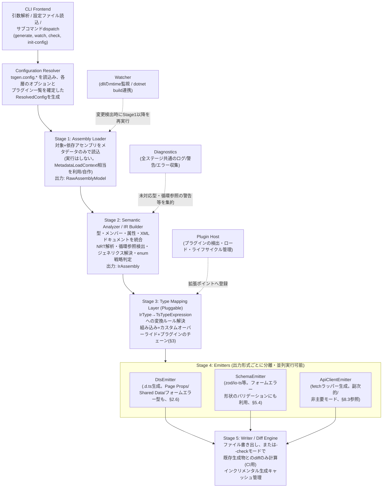
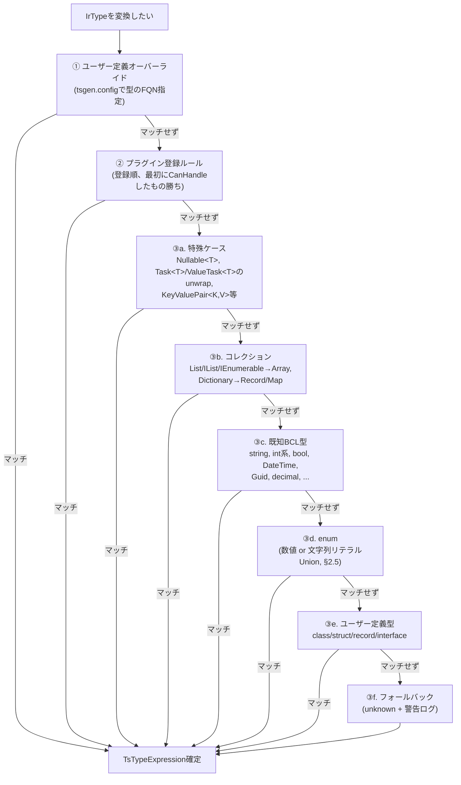
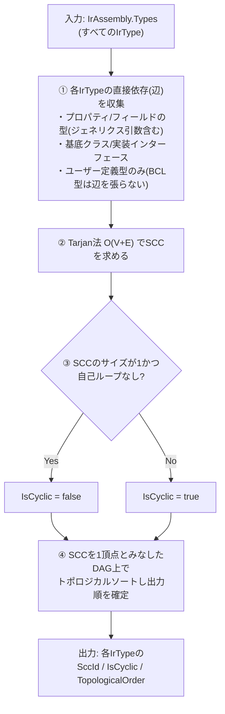
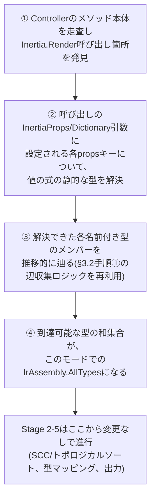
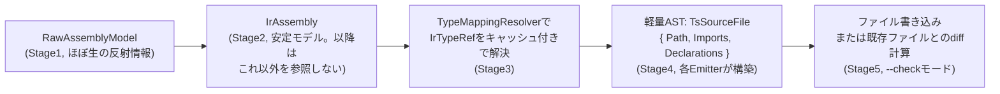

# oxygene-tsgen 設計書 (Phase 1)

> 🇬🇧 [English version](./DESIGN.md)

**ステータス**: 設計フェーズ完了。実装 (Phase 2) 未着手。
**対象**: 最大構成 (フルスコープ) の設計。MVP範囲は本書末尾で明示する。
**実装言語**: Oxygene (RemObjects Elements, `.NET` ターゲット = **Echoes** バックエンド)。

このドキュメントは「なぜこの設計にしたか」を必ず併記する。理由の記述を省略した箇所はない
(不明な場合は「未決定・要検証」として明記している)。判断に迷った箇所の詳細は
`HANDOFF.md` に整理してあるので、Phase 2 着手時は本書と合わせて読むこと。

---

## 0. 目的とスコープ

### 0.1 目的

.NET アセンブリ (`*.dll`) を `System.Reflection` (相当) で読み込み、TypeScript の型定義を
生成する CLI ツール。**`HANDOFF.md` §6 に記載した設計方針転換 (ピボット) 以降、主な用途は
ASP.NET Core + Inertia.js 構成のアプリケーションにおける、Inertia.js ページコンポーネント
向け TypeScript Props型の生成である**: Controller が `Inertia.Render(componentName, data)`
で返す `data` の型を、対応するフロントエンド側ページコンポーネント (例:
`resources/js/Pages/PageName.tsx`) が受け取る Props型として生成すること、それに加えて
全ページ共通で注入される「共有データ (Shared Data)」とのマージ、および Inertia の
`useForm()` クライアントフックが要求するフィールド単位のバリデーションエラー型の生成を
主眼とする。

これは、本ツールの当初のより汎用的な位置づけ (「任意の.NETアセンブリ→任意の
TypeScript出力」) からのスコープ絞り込みである。ただし基盤となる仕組み (型マッピング層、
IR、NRT解析、循環参照検出) は引き続き汎用のままであり、Inertia.js を使わないプロジェクト
向けの、汎用的な .NET → TypeScript 型定義生成 (任意でランタイム検証スキーマ zod/io-ts や
API クライアントの fetch ラッパーを含む) としても引き続き機能する。具体的なユースケースは
§0.2、Inertia向けモードと汎用モードの関係は §8 を参照。

### 0.2 想定ユースケース

**主 (Inertia.js):**

- ASP.NET Core の Controller アクションが `Inertia.Render(componentName, data)` で
  レンダリングする Inertia.js ページコンポーネントの Props型を、フロントエンド側で
  手動で二重管理して知らぬ間にドリフトさせるのではなく、Controller コードから直接
  自動生成する。
- Inertia ミドルウェアの `share()` 相当の機構で全ページに注入される「共有データ」
  (現在の認証ユーザー、フラッシュメッセージ等) を、各ページ固有の Props と統合した
  単一の一貫した Props型にマージする (§2.6, §8.2)。
- Inertia の `useForm()` クライアントフックが要求する、フィールド名→エラーメッセージの
  型を .NET側のバリデーション属性 (`[Required]` 等) から直接生成し、フロントエンド側の
  フォームエラー処理をバックエンドのバリデーションルールと手動同期させずに済むようにする
  (§5.4)。

**副 (汎用 .NET → TypeScript、引き続きサポート、§8.3参照):**

- Inertia.js を使わないプロジェクトも含め、より一般的に ASP.NET Core などの .NET
  バックエンドの DTO/エンティティ定義を単一の真実源とし、フロントエンド
  (TypeScript/React/Vue 等) の型を自動生成してドリフトを防ぐ。
- OpenAPI をすでに生成しているプロジェクトで、型情報をより正確に (ジェネリクス・
  nullable・enum など) TypeScript に反映したい場合の代替/補完。
- 社内 SDK として .NET ライブラリを配布しつつ、TypeScript 版クライアントも自動生成したい
  場合。

### 0.3 非目標 (Non-Goals)

- .NET → TypeScript の「トランスパイル」(ロジック/実行コードの変換) は行わない。
  対象はあくまで型・シグネチャ・メタデータであり、メソッド本体は生成しない
  (API 関数のみ、HTTP 呼び出しラッパーとして生成する。詳細は §8.3)。
- 全ての .NET 型システムの機能を網羅することは目指さない (例: 任意の deep な
  リフレクションのみで表現される動的型、`dynamic`、リフレクション専用の内部型など)。
  未対応の型は明示的に `unknown`/`any` にフォールバックし、警告を出す方針とする
  (詳細は §2.4)。
- C#の制御フローや任意の式評価を完全にモデル化することは目指さない。Inertia.js
  ユースケース向けに導入するエントリポイント駆動解析 (§3.5) は、Controller の
  アクション本体から `Inertia.Render(...)` の呼び出し箇所を見つけ、そこで渡される
  `data` 引数の静的な型を特定できれば十分であり、任意のビジネスロジックを解釈しよう
  とはしない。この限定的なメソッド本体解析ですら、Oxygene製のCLIから実現可能かどうかは
  未検証であり、新たな技術的リスクとして §3.5 に明記する。

---

## 1. アーキテクチャ全体図

### 1.1 コンポーネント分割



補助コンポーネント (上記パイプラインの外側):

- **Watcher**: ファイルシステム監視 (対象 .dll の mtime、または `dotnet build` 連携)
  → 変更検出時に Stage 1 以降を再実行。
- **Plugin Host**: プラグインの検出・ロード・ライフサイクル管理 (§6)。
- **Diagnostics**: 全ステージ共通のログ/警告/エラー収集 (未対応型のフォールバック、
  循環参照の警告などを一元的に集約し、CLI 終了時にサマリ表示)。

**補足 (ピボット後、`HANDOFF.md` §6参照)**: Inertia.jsプロジェクト向けの主要な出力である
Page Props / Shared Data / フォームエラー型は、既存の `DtsEmitter` がそのまま通常の
`.d.ts` として出力する。新規の Stage 4 コンポーネントは不要で、新しいのは Stage 3 手前の
追加IR入力 (§7.1) と解決ロジック (§2.6, §3.5) のみである。一方 `ApiClientEmitter` の
fetchラッパー生成は、パイプラインの主要出力から副次的/任意モード (§8.3) へ格下げされる。

### 1.2 設計判断: なぜ5段階パイプライン+IRを挟むのか

- **理由1 (関心の分離)**: 「.NET のメタデータをどう読むか」と「TypeScript として
  どう表現するか」を混ぜると、リフレクション API の癖 (Oxygene 側の
  `System.Reflection` 互換実装の制約、§4 参照) が出力ロジック全体に染み出し、
  保守性が悪化する。IR を挟むことで、Stage 1/2 の変更 (例: 将来 Roslyn 経由の
  ソース解析を追加する等) が Stage 3/4 に影響しないようにする。
- **理由2 (テスト容易性)**: IR は素朴なデータ構造 (POCO/レコード) なので、
  Stage 3/4 のユニットテストは実アセンブリなしで IR を手組みして実行できる。
  実アセンブリ読み込みが絡む Stage 1/2 のテストと分離できる。
- **理由3 (複数出力形式への対応)**: `.d.ts` / zod スキーマ / API クライアントという
  3種の出力 (§0.2, §7) はいずれも「型が何であるか」という同じ情報を必要とするため、
  共通の IR から分岐させるのが自然。IR がなければ同じ解析ロジック
  (NRT解析、循環参照検出等) を出力形式ごとに重複実装することになる。
- **代替案として検討したもの**: 「Loader が直接 TS AST を組み立てる 2段階パイプライン」
  も検討したが、上記の理由で却下。小規模な CLI ツールとしてはオーバーエンジニアリング
  という意見もあり得るため、MVP (§8) では Stage 2 の一部 (NRT解析等) を簡略化した
  「軽量 IR」から始め、フルスコープの解析は段階的に追加する方針とする。

---

## 2. 型マッピング層の抽象化設計

### 2.1 基本構造

```oxygene
type
  // TypeScript側の型表現。AST寄りだが出力に必要な最小限の情報のみ持つ。
  TsTypeExpression = public class
  public
    Kind: TsTypeKind; // Primitive, Reference, Array, Tuple, Union, Generic, Literal, Function, ...
    Name: String;               // Reference/Generic の場合の型名 (例: "Array", "MyNamespace.Foo")
    TypeArguments: List<TsTypeExpression>; // ジェネリクス実引数
    ElementType: TsTypeExpression;         // Array/Nullable Union の要素型
    UnionMembers: List<TsTypeExpression>;  // Union (nullable は `T | null` として表現)
    LiteralValues: List<String>;           // 文字列リテラルUnion (enum戦略が string の場合)
  end;

  // 型マッピングルール1件の入力/出力契約
  ITypeMappingRule = public interface
    // このルールが IrType を処理できるかどうかを判定する (優先度付きチェーンで使用)
    method CanHandle(aType: IrType; aContext: MappingContext): Boolean;
    // 実際の変換。ネストした型 (ジェネリクス引数等) の解決は
    // aContext.ResolveType() を再帰的に呼び出す (下記2.3参照)
    method Map(aType: IrType; aContext: MappingContext): TsTypeExpression;
  end;
```

### 2.2 ルール解決の優先順位チェーン



### 2.3 拡張可能にする理由と設計

- **なぜ「チェーン+CanHandle」方式か**: 単純な `Dictionary<FQN, TsType>` のマップだと
  ジェネリクスや構造的な型 (タプル、配列の配列等) を表現できない。関数的なルール
  (`CanHandle`/`Map`) にすることで、「名前空間が `MyCompany.*` かつジェネリクスで
  `Result<T,E>` の形をしている型は `Result<T> | Error<E>` に変換する」といった
  構造的なマッチングが可能になる。これはプラグイン機構 (§6) の基盤でもある。
- **`MappingContext.ResolveType()` を再帰の入口にする理由**: 個々のルールが
  「自分の直接の型」だけでなく「ネストした型引数の解決」を毎回自前で書くと
  循環参照検出やキャッシュのロジックが重複する。`MappingContext` が
  訪問済み型のスタック (循環検出用、§3) とキャッシュ (同じ型を何度も解決しない)
  を一元管理し、ルール実装者はそれを意識しなくて良いようにする。
- **優先順位を「最初にCanHandleしたもの勝ち」にした理由**: スコア方式 (最も詳細な
  ルールを自動選択) も検討したが、実装が複雑になり、かつルール間の優先順位が
  暗黙的になり事故りやすい (プラグイン作者から見て「なぜ自分のルールが呼ばれないか」
  が分かりにくい)。明示的なチェーン順序の方がデバッグしやすく、設定ファイルで
  ユーザーが優先順位を上書きできる余地も残せる。

### 2.4 未対応型のフォールバック方針

- 変換できない型は `unknown` として出力し、`Diagnostics` に
  `WARN: cannot map type 'X', falling back to unknown` を記録する。
  CI の `--check --strict` モードではこれをエラー扱いにできるオプションを用意する
  (未対応型が知らぬ間に増えることを防ぐため)。
- **理由**: 生成を止めてしまうと「1つの型が読めないだけで全体が失敗する」という
  体験になり、大規模アセンブリでの採用障壁になる。段階的移行 (MVP → フルスコープ)
  の運用とも相性が良い。

### 2.5 enum 戦略 (数値 or 文字列リテラルUnion)

- 設定でグローバルデフォルト (`numeric` | `stringUnion` | `constObject`) を選び、
  型単位で `[TsEnumStrategy(...)]` 相当のカスタム属性、またはFQN指定の設定で
  上書き可能にする。
- `stringUnion` の場合、`[EnumMember(Value = "...")]` (`System.Runtime.Serialization`)
  や `System.Text.Json` の `[JsonStringEnumConverter]` /
  `[JsonPropertyName]` 相当の情報があればそれを文字列値として優先し、
  なければ C# 側のメンバー名をそのまま文字列値にする。
  - **理由**: JSON シリアライズ時の実際の値と TS 型が乖離すると意味がないため、
    シリアライズ属性を可能な限り信頼できる情報源として扱う。

### 2.6 Inertia.js固有の型生成対象

`HANDOFF.md` §6 に記載したピボットを受けて、上記の型マッピング層の上に3つの追加の
型生成対象が乗る。いずれも末端の型解決は同じ `ITypeMappingRule` チェーン (§2.2) を通す
— 新しいのは個々のメンバー型の変換方法ではなく、各対象型を構成する「メンバーの集合」を
どう組み立てるかという部分である。

1. **Page Props型** — `Inertia.Render(componentName, data)` を呼び出す各Controller
   アクションについて、`data` の形 (通常は匿名型、またはインラインで組み立てられたPOCO)
   が `componentName` に紐付いた `interface`/`type` として生成される (具体的な命名・
   出力ファイル規約は未定 — §7.4と§11の未解決事項を参照)。これにはメソッド本体内での
   当該呼び出し箇所の発見 (§3.5) が必要であり、この部分は新規かつ未検証である。
2. **Shared Data型 — 2026-08-07実装済み。ただし以下に元々書いていた設計通り
   ではない — 完全なスパイク+実装の記録は`HANDOFF.md` §27を参照。**
   Inertiaミドルウェアの `share()` 相当の機構で全ページに注入されるデータ
   (現在の認証ユーザー、フラッシュメッセージ等) は、各ページ固有のProps型と
   マージする必要がある。この段落は元々、独立した `IrSharedDataContract`
   (§7.1) として表現し、生成される各Page Props型がこれと構造的に交差型合成
   する(`type PageProps<T> = SharedData & T`)形を提案していた —
   共有フィールドを各ページのinterfaceへ複製しないことで、共有データの内容
   変更時のドリフトを避けるためである。**実際に実装した内容**: 合成済みの
   `SharedData` interface(軽量IRでは、独立した`IrSharedDataContract`
   クラスではなく、もう1つの`IrTypeLite`として)を1つ生成し、各ページ自身の
   Props interfaceがこれと交差するのではなく`extends`する
   (`interface XxxProps extends Props.SharedData`)形にした。`extends`形式
   は新しいIRモデルの種別もEmitterの分岐も追加不要であり、また
   InertiaNetCoreの共有データは実行時に同名のページpropsを実際に**上書き
   する**ことがスパイクでソースコードに対して確認されているため、フィールド
   名衝突時にTypeScriptのコンパイルエラーになる方が、交差型が黙って`never`
   に潰れるより誠実だと言える。検出はInertiaNetCoreの実際の
   `AddInertiaSharedData(...)`ミドルウェア登録の呼び出し形状をスキャンする
   (単体の`Inertia.Share(...)`呼び出しは、InertiaNetCoreがアプリ全体の
   データと単一ページ固有の追加propの両方に同じ呼び出しを使うため、v1では
   意図的にShared Dataとして分類していない — 分類方針の議論の全体は
   `HANDOFF.md` §27参照)。また、登録の有無に関わらずInertiaNetCoreが全
   ページのペイロードに注入する3つのキー(`flash`、`timestamp`、`errors`)
   を常に含める。
3. **フォーム/`useForm()`エラー型 — 2026-08-07実装済み、`HANDOFF.md` §26参照。**
   Inertiaのクライアント側 `useForm()` フックは、バリデーションエラーに対して
   フィールド名→エラーメッセージの形を要求する。当初の計画(§5で設計済みの
   バリデーション属性反映、`[Required]`/`[StringLength]`等をそのまま再利用)は
   実際には採用**しなかった**: それには、あるページのフォーム送信を処理する
   POSTアクションを見つけてページ自体に関連付ける、新しいエントリーポイント
   検出の仕組みが必要になり、v1として出荷した規模よりかなり大きな機能になる
   ためである。実装したv1は代わりに、そのページ自身のProps型(上記item 1)で
   既に解決済みの同じフィールド名リストを再利用する — 新規スキャンは一切
   不要である一方、エラー形状のキーは「リクエストDTOのバリデーション対象
   フィールド」ではなく「そのページのProps」になる、というトレードオフを
   持つ。これはここで元々説明していた設計ではなく、意図的かつ見直し可能な
   v1スコープの選択である(`HANDOFF.md` §26)。`Partial<Record<'field1' |
   'field2' | ..., string>>`(またはpropsなしページの場合
   `Partial<Record<never, string>>`)を出力する。§5.4参照。

これらはいずれも `TsTypeExpression` の形 (§2.1) や優先順位チェーンによる解決の仕組み
(§2.2) を変更するものではない — 追加されるのはあくまで、そもそもどの `IrType` が
解決対象として存在するか、そのメンバーがどうグルーピングされて出力されるかを決める
新しい「入口」である。

---

## 3. 循環参照検出アルゴリズム

### 3.1 問題設定

TypeScript の `interface`/`type` 宣言自体は相互参照可能 (プロパティの遅延評価的な
性質のため、`interface A { b: B } interface B { a: A }` は問題ない)。
一方で問題になるのは:

1. **型引数の無限展開**: ジェネリクスの「構造的展開」を行う設計 (例: `Result<T,E>`
   を毎回インライン展開するような戦略) を採った場合、再帰的なジェネリクス
   (`TreeNode<T>` が `Children: List<TreeNode<T>>` を持つ、など) で無限ループする。
2. **zod/io-ts スキーマ生成**: ランタイム検証スキーマは「値」として定義されるため、
   TypeScript の型と違って遅延参照に工夫が要る (`z.lazy(() => schema)` 等)。
   循環を検出し、該当箇所を `lazy` 化する必要がある。
3. **単一ファイル出力時のトポロジカルソート**: 依存順に型定義を並べたい場合
   (可読性のため。TS的には順不同でも動くが人間が読みやすい方が良い)、循環がある
   グループはまとめて出力する必要がある。

### 3.2 アルゴリズム案

型を頂点、"直接参照" (プロパティ/フィールド/戻り値/引数の型として出現する) を
辺とする有向グラフに対し、**Tarjan の強連結成分分解 (SCC)** を IR構築の後処理
(Stage 2 の最終工程) として1回実行する。



### 3.3 検出結果の使い道 (Emitter側の分岐)

- **DtsEmitter**: `interface`/`type` は循環があってもそのまま出力可能なため、
  基本的に `IsCyclic` を無視できる。ただし「型を構造的にインライン展開する」設定
  (例: タプル的な匿名型展開) を使う場合のみ、循環を検出したら強制的に名前付き型
  として切り出す (展開をやめる) フォールバックを行う。
- **SchemaEmitter (zod)**: `IsCyclic = true` の型は `z.lazy(() => ...)` で包み、
  かつ TypeScript の型注釈 (`z.ZodType<T>`) を明示することで zod の型推論の限界を
  回避する。circular でない型は通常通り即時評価の式で生成し、可読性を優先する。
- **単一ファイル出力**: SCC単位でグループ化して出力順を決定 (§3.2 手順4)。

### 3.4 なぜこの設計か

- Tarjan法を選んだ理由: 循環検出だけなら単純なDFSの「訪問中」フラグでも十分だが、
  「循環しているグループをまとめて扱う」(zodのlazy化やトポロジカル順出力) には
  SCC分解の結果 (グループ単位のまとまり) がそのまま使えるため、最初からSCCベースで
  設計する方が後工程との整合性が良い。DFSベースの単純な検出だと「循環に含まれる
  型集合」を再度別ロジックで求め直す二度手間になる。
- 計算量: O(V+E) で、アセンブリ中の型数が数千規模でも実用上問題にならない想定。
  実測はPhase 2で確認 (大規模アセンブリでのベンチマークをタスクリストに追加、
  HANDOFF.md参照)。

### 3.5 エントリポイント駆動の型発見 (Inertiaモード)

> **改訂ノート (2026-08-02):** 以下の技術リスクの枠組みは、実現可能かどうか
> すら分かっていなかった実機検証前の段階で書かれたものである。その後スパイク
> (`HANDOFF.md` §22) がこれを解決した: **実現可能、ソースレベルのトークン
> スキャンによって** — 本節が元々挙げていた(a)/(b)のどちらでもない第3の
> 選択肢による。全容は§22参照。以下の要約は「どちらの手法も試作されていない」
> という旧来の枠組みを置き換える。
>
> **2026-08-02実装済み、`HANDOFF.md` §24参照:** `tsgen generate --mode
> inertia`がこのモードを実際に実行する —
> `src/Tsgen/Inertia/InertiaScanner.pas`(呼び出し箇所+propsフィールド
> 検出)と`src/Tsgen/Inertia/InertiaIrBuilder.pas`(本節の図の手順①→③に
> あたる到達可能性BFS。循環参照検出は依然として先送りのため
> SCC分解は除く、`HANDOFF.md` §23.1)。v1のスコープ: リテラル/識別子/
> 非genericの`new NamedType(...)`というprops値は解決するが、
> `new class(...)`によるanonymousリテラル、メソッドをまたいだprops
> 構築、条件分岐依存のキー設定、`Inertia.Defer`/`Inertia.Merge`の
> アンラップはまだ対応していない(完全な一覧は`HANDOFF.md` §24.6。
> いずれも見落としではなく意図的なv1の境界線)。

**問題設定**: 上記の §3.1–3.4 は既存のモデル — アセンブリ全体をスキャンして
`IrAssembly.AllTypes` を全型から構築し、その全体から循環を探す — を前提としている。
この前提はInertia.jsユースケースにはあまり合わない。典型的なASP.NET Core +
Inertia.jsのController用アセンブリには、`Inertia.Render` に一度も渡されない型
(内部サービス用DTO、ページに露出しないEF Coreエンティティ等) が多数含まれ、
それら全てに対して `.d.ts`/Props型を生成すると、フロントエンドが必要としない
ノイズが増える。

**提案する方式**: `IrAssembly.AllTypes` をアセンブリ内の全型からシードするのではなく、
エントリポイント駆動モードでは **`Inertia.Render` の呼び出し箇所から到達可能な型のみ**
からシードする:



これは循環参照検出 (§3.2手順①、辺の収集) のために既に構築済みのグラフ走査機構を
そのまま再利用する — 新規なのは手順①/②: **呼び出し箇所の発見と、各propsキーの
値の型の解決** であり、これには型/メンバーのシグネチャだけでなくメソッド本体の検査が
必要になる。

**InertiaNetCoreの実際のAPIの形 (`HANDOFF.md` §22.1、本節の元々の想定を解決)**:
`Render(component, 任意のPOCO)`というオーバーロードは存在しない。実際の
シグネチャは`Render(string)`、`Render(string, InertiaProps?)`、
`Render(string, Dictionary<string, object?>?)`であり、
`InertiaProps : Dictionary<string, object?>`である。したがって`data`引数の
*静的*な型は常に`InertiaProps`/`Dictionary`であり、単体では何の情報にも
ならない。手順②は「1つの式の型を解決すること」ではなく、「propsの辞書に
追加される文字列キー1つ1つについて、割り当てられる値の式の型を解決すること」
になる。

**手順①/②が実際にどう解決されるか — ソースレベルのトークンスキャン、IL解析でも
Roslyn風の解析でもない(`HANDOFF.md` §22.2–§22.6)**: これまで知られていな
かったOxygene固有の事実がこれを実現可能にしている — **Oxygeneにはオブジェクト/
コレクション初期化子構文が存在しない**。動作しそうに見える波かっこの形式
(`new InertiaProps { ['Key'] := value }`)は黙ってno-opにコンパイルされ
(波かっこはOxygeneのブロックコメントの区切り文字として消費され、空の辞書が
残る — トークンを見ただけでなく実行時にも確認済み)、丸かっこの形式は実
コンパイルエラーになる。**動作する構文は構築後の連続したインデクサ代入
だけである**(`var props := new InertiaProps; props['Key'] := value; ...`)。
つまり実際のOxygeneコードはこの1つの形しか生成できず、完全にソース上に
現れる。インラインリテラルの代替を別途扱う必要もない。この形は
`RemObjects.Elements.Code.TokenStream`(`NullabilityScanner`が既に使って
いるのと同じトークナイザ、§16)で綺麗にトークナイズされ、機構的には
`NullabilityScanner`の丸かっこ/角かっこの深さを追跡するトークン走査が
既に解決している問題と同じクラスである(§18.2のindexerスキップロジックは、
ここで必要なインデクサ代入検出と構造的に同じ形をしている)— 本節が元々
挙げていた(a) IL解析も(b) Roslyn構文木解析も不要である。

**propsの値の型解決に実際に必要なもの (`HANDOFF.md` §22.5–§22.6)**:
メソッド単位のローカル変数の型追跡(パラメータの宣言型 + `var x := new T`
のローカル宣言。`NullabilityScanner`は今のところこの概念を持たない)、
そしてあえて小さく絞った値の式の形に対する型推論(リテラル、追跡している
宣言型を引く単純な識別子、`new NamedType(...)`、そしてOxygeneの
`new class(...)`によるanonymousリテラル — C#の`<>f__AnonymousType0`と
同様の本物の、reflectableな合成ジェネリック型にコンパイルされることを
確認済みだが、ここではreflectionではなく自身のソースレベルのプロパティ
ペアを解析することによってのみ利用可能)。propsのキーから型へのマッピング
自体の解決にreflectionは一切関与しない(メソッド本体はメタデータのみの
読み込みからは不可視)— しかし値が*名前付き*型に解決された時点で、
既存の`AssemblyLoader`/`IrBuilder`のreflectionパイプライン(上記手順③)が
新規コード一切なしにその型の形状を処理してくれる。これはまさにこの図が
元々前提としていた通りである。v1のスキャナではあえてスコープ外とする:
条件分岐/ブランチ依存のキー設定、ヘルパーメソッド呼び出し経由で設定される
キー、`Inertia.Defer(...)`/`Inertia.Merge(...)`でラップされた値(実際の
型はasyncラムダの戻り値の型)、動的キー、`Render`が実際に呼ばれるのとは
別のメソッド/クラスで構築されるprops — これらは未解決のキーごとに
`unknown` + 診断警告へ段階的に劣化させるべきであり、ページ全体の生成を
ブロックすべきではない。

**フォールバック、今は難しいケースのみに限定(機能全体のではない)**:
アセンブリ全体スキャンモード(§3.1–3.4、変更なし)や型ごとの明示的
アノテーションは、上記のスコープ外ケース向け、あるいは自動検出に頼りたく
ないユーザー向けに引き続き利用可能である — しかし`HANDOFF.md` §22.7の
推奨により、エントリポイント駆動の自動検出は最後の手段としてのフォール
バックではなく*主軸*の仕組みとすべきである。確認済みの動作する連続代入
パターンは、現実的に実際のOxygene Inertiaコードが生成しうる唯一のもの
だからである。

---

## 4. NRT (Nullable Reference Types) 解析方針

> **改訂メモ (2026-08-02):** このセクションは元々、実機検証を一切行う前 —
> Echoes が NRT メタデータをそもそも出力するのかどうかが最大の未解決事項
> (§11 項目1) だった時点 — に書かれたものである。実機検証の結果
> (`HANDOFF.md` §8) と、それを受けた MVP 実装 (`HANDOFF.md` §11–§13) を
> 反映して書き直した。元の設計のプロバイダチェーンという骨格はそのまま
> 生きている。変わったのは「どのプロバイダが主軸か」である。

### 4.1 調査結果のサマリ (Web調査+実機検証)

このセクションでは、Web 調査で確認できたこと、その後実機検証で確認できたこと、
そして依然として本当に未確定なことを分けて記載する。

**Web調査で確認できたこと (2026年7月時点):**

- C# の Nullable Reference Types (NRT) は言語機能であり、CLR自体には
  nullability の概念がない。Roslyn (C#コンパイラ) は `?`/非`?` の情報を
  `System.Runtime.CompilerServices.NullableAttribute` (メンバー単位、
  `byte` または `byte[]` フラグ) と `NullableContextAttribute`
  (型/モジュール単位のデフォルト文脈) という、どちらも**標準の .NET カスタム属性**
  としてIL メタデータに埋め込む。値は `0=Unknown, 1=NotNullable, 2=Nullable`
  ([出典: Roslyn nullable-metadata docs, Rico Suter氏のブログ等])。
- これは **C#コンパイラ (Roslyn) 固有の出力規約** であり、CLR/BCL 標準の
  一部ではない。つまり「読む側」は `System.Reflection` の標準APIだけでなく、
  この特定のカスタム属性を認識してデコードするロジックを自前で書く必要がある
  (Roslynの `NullableAnnotation` 相当の情報は `System.Reflection` の
  標準プロパティとしては公開されていない)。
- Oxygene (Elements) は `.NET` ターゲットに **Echoes** という専用バックエンドを
  使用し、C#/VBコンパイラと同様に標準IL/メタデータを出力する
  (RemObjects公式: 「Microsoft の Visual C#/VB コンパイラと同様にIL codeへ
  コンパイルされ、CLRが動く場所ならどこでも動く」との説明あり)。
  標準IL出力である以上、`CustomAttributeData` としてのカスタム属性一般は
  `System.Reflection` 互換APIから読めるはずである。
- Oxygene 言語自体は `nullable T` / `not nullable T` という明示的なキーワードで
  nullability を表現する (C#の `T?`/`T!` に相当する Elements 統一構文の一種、
  RemObjects公式ドキュメント「Nullability」「Oxygene/Types/Nullability」による)。
  デフォルトは「参照型は nullable、値型は non-nullable」で C# と同じ考え方。

**実機検証で確認できたこと (2026-08-01、`HANDOFF.md` §8) — 本セクションの
旧版が最重要リスクとしてフラグを立てていた未確認事項は、これで解決した:**

- Oxygene の Echoes バックエンドは、Oxygene で書かれたコードについて
  **NRT 情報をコンパイル済みアセンブリのメタデータに一切出力しない** —
  `NullableAttribute`/`NullableContextAttribute` も、Oxygene 独自のカスタム
  属性も、modopt/modreq カスタム修飾子も、何も無い。`nullable`/`not nullable`
  宣言を含むプローブ用アセンブリをビルドし、あらゆるレベル (アセンブリ、
  モジュール、型、フィールド、プロパティ、メソッドのパラメータ/戻り値) で
  `CustomAttributeData` とカスタム修飾子を列挙して検証済み。
- それでも nullability 修飾はコンパイラが強制する本物の言語機能である
  (例: `not nullable` のフィールド/プロパティは宣言箇所での初期化が
  コンパイル時に強制される — `HANDOFF.md` §8.1)。情報は存在し検査もされて
  いるが、ソースコードの外に一切出てこないというだけである。
- 帰結: **Oxygene で書かれたアセンブリについては、リフレクションベースの
  NRT 復元は不可能であり、ソースレベル解析が現時点で判明している唯一の
  実行可能な経路である。** リフレクションベースのプロバイダに残る価値は、
  対象と一緒にロードされる C#/VB 製の依存アセンブリに対してのみ —
  Oxygene コードに対しては例外なく全メンバーで Unknown を返す。

**依然として未確認 (手がかりとして追跡中、ブロッカーではない):**

- RemObjects からの返信 (`HANDOFF.md` §9.4) に、NRT 情報は「おそらく
  アセンブリの metadata.fx スライスにある」との示唆があった — §8 の検証で
  調べた標準 ECMA-335 属性テーブルの外にある、Elements 固有のメタデータ
  領域の可能性がある。存在自体も、コンパイラの外から読めるかどうかも
  未検証。もし裏付けが取れれば、メタデータベースの復元経路が復活し、
  後述のソーススキャナは最適化ないしフォールバックに格下げされる。それ
  までは本設計はソーススキャン路線で進めるが、§4.2 のプロバイダチェーンには
  意図的に `MetadataFxProvider` 用のスロットを空けてある。ソーススキャナの
  さらなる強化に投資する前に、この手がかりを先に確認すること
  (`HANDOFF.md` §9.4)。

### 4.2 設計方針: プロバイダチェーン、主軸はソーススキャナ

**「NRT情報ソースを差し替え可能なプラガブルな抽象」** (`INullabilityProvider`)
は当初の設計のまま維持する — この抽象は実機検証がどちらに転んでも吸収できる
ように導入したものであり、実際にその役目を果たした: §8 の結果への適応は
「どのプロバイダをどの優先順で持つか」の問題であって、再設計ではない。

```oxygene
type
  // NRT解析結果。Emitter/型マッピング層はこれだけを見る。
  NullabilityInfo = public class
  public
    State: NullabilityState; // Unknown, NotNullable, Nullable
    Source: NullabilitySource; // どの情報源から判定したか (診断・デバッグ用)
  end;

  NullabilitySource = public enum (
    SourceTokenScan,        // Oxygeneソース中の nullable / not nullable トークンを発見 (主経路、§8)
    ExplicitAttribute,      // NullableAttribute等を直接発見 (C#/VB製の依存アセンブリ)
    ContextAttribute,       // NullableContextAttributeからの継承
    ValueTypeDefault,       // 値型のデフォルト規則から推定
    NoInformation           // 何も情報がなく Unknown 扱い
  );

  // 差し替え可能なNRT情報プロバイダ。複数登録可能で、優先順に最初に
  // Unknown以外を返したものを採用する (型マッピングのCanHandleチェーンと同じ思想)。
  INullabilityProvider = public interface
    method TryGetNullability(aMember: IrMemberRef; aContext: AnalysisContext): NullabilityInfo;
  end;
```

プロバイダの構成 (優先順):

- **プロバイダ1 (主軸): `OxygeneSourceScanProvider`** — プロジェクト自身の
  `.pas` ファイルに対するソースレベルのトークンスキャン。自前の字句解析
  ではなく Elements SDK 公式のトークナイザ API の上に構築する
  (`HANDOFF.md` §7)。§8 の結果により、これは最適化などではなく
  **Oxygene で書かれたコードに対して Unknown 以外を返せる唯一の実装**で
  あり、だからこそ MVP は本セクションの旧版が示唆していたような後回しに
  せず、初日からこれを実装した (`HANDOFF.md` §11)。実装の実態
  (`src/Tsgen/Nrt/NullabilityScanner.pas`、`HANDOFF.md` §12): 明示的に
  ヒューリスティックなスキャナ — フルパーサではない — で、トップレベル型の
  プロパティとフィールドにスコープを絞る(1つの`type`セクションに複数の型
  宣言が並んでいてもよく、indexer形式のプロパティにも対応している。
  `HANDOFF.md` §18.2/§18.3)。`RemObjects.Elements.Code.TokenStream`で
  本物のOxygeneトークナイザを直接駆動しており(以前の`SimpleTokenizer`
  ベースの実装から刷新済み、`HANDOFF.md` §16)、トークンID定数は
  `RemObjects.Elements.Code.Oxygene.Token` の公開フィールドを直接参照する
  (`HANDOFF.md` §13)。唯一残っている既知の制限であるnested typesは、
  単なるスキャナの穴ではない: LoaderがIRに届く前に`IsNested`な型を
  丸ごと除外しており、Emitter側にもネストした`interface`の出力機構が
  存在しないため、スキャナ単体ではなく3段階にまたがる協調した変更が
  必要になる(`HANDOFF.md` §18.1)。メソッドのパラメータ/戻り値の NRT は
  Inertia Page Props の形に影響しないため別途意図的に先送りしている。
  両者とも `HANDOFF.md` §12.6/§18 に整理してある。ソースへの
  アクセスが必要になるため、`--assembly` に加えて `--source <dir>` という
  CLI 入力が増える — 元のリフレクションのみの設計には不要だった入力である。
- **プロバイダ2: `RoslynStyleAttributeProvider`** — 標準の
  `NullableAttribute`/`NullableContextAttribute` を解釈する。**当初の
  「Oxygene アセンブリもカバーできる想定」という役割からは格下げ**: §8 に
  より Oxygene が書いたものに対しては全て Unknown を返すため、残る価値は
  対象と一緒にロードされる C#/VB 製の依存アセンブリに対してのみ。未実装
  (MVP後)。
- **プロバイダ3: `ValueTypeDefaultProvider`** — 変更なしの保守的
  フォールバック: 値型は non-nullable、参照型は「情報無し=Unknown」。
- **空きスロット: `MetadataFxProvider`** — 未確認の metadata.fx の手がかり
  (§4.1) のために予約。裏付けが取れた場合、ソースが入手できないアセンブリ
  向けにプロバイダ1の前段に入る (または置き換える)。

**実装状況 (`HANDOFF.md` §21 時点で更新、2026-08-02):**
`INullabilityProvider` チェーンは配線済み
(`src/Tsgen/Nrt/NullabilityProviders.pas`)。上記のより抽象的な
`IrMemberRef`/`AnalysisContext` 案ではなく、このツールが実際に持っている
具体的なデータ(型のフルネーム+メンバー名+生のCLR型名の文字列)に
合わせた形になっている — `IrBuilder.Build`が`List<INullabilityProvider>`
(`OxygeneSourceScanProvider`、続いて`ValueTypeDefaultProvider`)を構築し、
各メンバーを`NullabilityProviderChain.Resolve`で解決する(最初に
Unknown以外を返したプロバイダが勝つ)。プロバイダ2
(`RoslynStyleAttributeProvider`)は依然として本当に未実装のまま —
チェーンには実在する2つのプロバイダだけが入っており、3つ目のための
スタブは置いていない。IRの三値の結果
(`Unknown`/`IsNullable`/`IsNotNullable`)は以前と変わらず未解決のまま
Emitterまで運ばれており、これがあったからこそProvider 3をIRの形を
一切変えずに追加できた。

### 4.3 なぜこの設計か

- 元の原則 — 「不確実な外部要因 (コンパイラのメタデータ出力仕様) に依存する
  解析ロジックは、差し替え可能なプロバイダとして切り出す」 — は、もはや
  仮説ではなく実証済みとなった: 検証の結果 (§8) は旧版が想定していた中で
  *最悪の*ケース (別の属性ですらなく、メタデータが一切無い) だったにも
  かかわらず、その吸収に必要だったのは再設計ではなく「どのプロバイダが
  主軸か」の変更だけだった。同じ理由で、チェーンにはソーススキャナを
  最終形と断定せず metadata.fx (§4.1) 用の空きスロットを残してある。
- Unknown 状態を明示的に第一級で扱う理由 — そしてこれは §8 の後、重要性が
  増しこそすれ減ってはいない: **リフレクション越しに見た Oxygene 製コード
  にとって、Unknown は稀なエッジケースではなく、恒常的に発生するデフォルト
  状態である** (`HANDOFF.md` §8.3)。実務上の帰結は2つ:
  - 意味のある NRT 出力には `--source` が必要であり、省略時には CLI が
    「全メンバーが unknown ポリシーのデフォルトにフォールバックする」旨を
    警告する (黙って劣化しない)。
  - Unknown ポリシーの選択は、例外的な入力への逃げ道ではなく、初回実行時の
    通常の判断事項である。
- 「わからない」を握りつぶして勝手に non-null と判定すると、実行時に null が
  来てランタイムエラーになる TypeScript コードを生成してしまう (安全性の
  欠如)。逆に全部 nullable 扱いにすると型の有用性が下がる。ユーザーが
  `--nrt-unknown-policy`(実際のCLIフラグの値としては`nullable` |
  `non-null` | `mark-unknown`)を選べるようにし、暗黙の安全性判断を
  ツールが勝手に行わないようにする。**3つとも実装済み**
  (`HANDOFF.md` §21)。`mark-unknown`は`non-null`と同じ素の型を
  出力しつつ(TypeScriptには「nullabilityが未確定」を「non-nullable
  確定」と型レベルで区別する手段がないため)、末尾に
  `// nrt: unknown`という行コメントを付与する — 架空の型を発明する
  ことなく、目視・grep両方で区別できるようにしている。

---

## 5. メタデータ・属性反映

### 5.1 対応する属性・情報源

| 情報源 | 反映先 | 備考 |
|---|---|---|
| `System.Text.Json.Serialization.JsonPropertyName` | プロパティ名変換 | 最優先。無ければ `JsonNamingPolicy` 設定 (camelCase等) をシミュレートして命名規則変換 |
| `System.Text.Json.Serialization.JsonIgnore` | プロパティ除外 | `Condition` (WhenWritingNull等) は簡易対応、詳細はPhase 2で仕様確定 |
| XML Doc コメント (`///`, Oxygene側は `///` または `{{ }}` 相当の構文を要調査) | JSDoc (`/** ... */`) | アセンブリ横に生成される `.xml` ドキュメントファイルをMSBuild同様の慣習で探索して読み込む |
| `System.ObsoleteAttribute` | `@deprecated` JSDocタグ | `Message`/`IsError` も反映 |
| `System.ComponentModel.DataAnnotations.*` (`Required`, `StringLength`, `Range`, `RegularExpression`等) | zod/io-tsスキーマの制約 | §5.3 |
| `[EnumMember]` / `[JsonStringEnumConverter]` | enum文字列リテラル値 | §2.5 |

### 5.2 XML ドキュメントコメント統合の設計

- .NET の標準的な `AssemblyName.xml` (MSBuildが `<GenerateDocumentationFile>` で
  生成するもの) を、アセンブリ本体と同じディレクトリから探索して読み込む
  (見つからない場合は警告のみでスキップ、必須にはしない)。
- XMLの `<member name="...">` の `name` 属性 (例: `M:Namespace.Type.Method(System.String)`)
  から IR 内の該当メンバーへの解決テーブルを Stage 2 で構築する。
  **理由**: リフレクションメタデータには無いドキュメント文字列を紐付ける唯一の
  標準的な方法であり、C#/Oxygene問わず共通のXML形式であるため言語非依存に扱える。
- `<summary>` → JSDoc本文、`<param>` → `@param`、`<returns>` → `@returns`、
  `<exception>` → `@throws` の対応表をテンプレート化する。
- Oxygene側のドキュメントコメント構文がXML docコメントとして同一形式で
  出力されるかは要確認 (Phase 2着手時の確認事項としてHANDOFF.mdに記載)。

### 5.3 バリデーション属性 → zod/io-ts スキーマ

- `SchemaEmitter` は「バックエンド (zod / io-ts / 将来的にvalibot等)」を
  プラグイン的に切り替え可能にする (§6と同じプラグイン機構を再利用)。
- マッピング例:
  - `[Required]` → optional から必須へ (nullable/NRT解析結果と統合して判定)
  - `[StringLength(max, MinimumLength = min)]` → `z.string().min(min).max(max)`
  - `[Range(min, max)]` → `z.number().min(min).max(max)`
  - `[RegularExpression(pattern)]` → `z.string().regex(new RegExp(pattern))`
- **理由 (なぜ型定義と分離した別Emitterか)**: `.d.ts` は型情報のみで実行時コストが
  ゼロだが、zod等のスキーマは実行時に評価される値である。両者は「同じIRから
  生成されるが性質の異なる成果物」であるため、Stage 4 で別Emitterとして
  完全に分離し、`.d.ts` のみが必要なユーザーはSchemaEmitterを無効化して
  ビルドコストを避けられるようにする。

### 5.4 バリデーション属性 → Inertiaフォームエラー形状

**2026-08-07実装済み。ただし以下に元々書いていた計画通りではない —
`HANDOFF.md` §26参照。** 本節は元々、§2.6 (項目3) の `useForm()` 向け
型対象が、§5.3のzod/io-tsスキーマ生成向けに既に設計済みの
`System.ComponentModel.DataAnnotations.*` 反映ロジックを再利用し、
フィールド名はバリデーション対象のリクエストDTO属性から取得すると
提案していた。これは実際には実装されなかった: そのためには、ある
ページのフォーム送信を処理するPOSTアクションを見つけてページに
関連付ける、新しいエントリーポイント検出の仕組みが必要になり、v1と
して出荷したものよりかなり大きな機能になるためである。

**実際に実装した内容**: フィールド名は、そのページ自身のProps型
(§2.6項目1) で既に解決済みの同じフィールドリストから取得する —
`DataAnnotations`反映は一切行わず、新規スキャンも不要である。出力
形状(`Partial<Record<'field1' | 'field2' | ..., string>>`、または
propsなしページの場合`Partial<Record<never, string>>`)は本節が元々
提案していた通りだが、フィールド名の取得元だけが異なる。意図的なv1
スコープの選択であり(`HANDOFF.md` §26)、Shared Data型や実際の
リクエストDTOスキャンが実装され、自然なページ⇔アクションの対応付け
の仕組みが利用可能になった時点で見直すことを明示的に想定している。
Inertiaのクライアント側 `useForm<TFormErrors>()` 相当フックのジェネ
リック引数として利用されることを想定する。

このジェネリック引数について本節が元々未決としていたアダプタ・
フロントエンドフレームワーク依存のシグネチャ問題は、v1では
アダプタを選定する形ではなく、実用的な形で決着した:
素朴な`Partial<Record<...>>`形式を採用した。これはアダプタに
依存せず、フレームワークの選定を先に済ませる必要がないためである。
選定したInertia React/Vue/Svelteアダプタ自身の型定義がより特化した
形を望むかどうかは未決のままだが、もはやブロッカーではない —
素朴な形はどのアダプタでも動作する。

---

## 6. プラグイン機構のインターフェース設計

### 6.1 拡張ポイント一覧

1. `ITypeMappingRule` (§2) — 型変換ルールの追加
2. `INullabilityProvider` (§4) — NRT情報ソースの追加
3. `INamingStrategy` — プロパティ/型名の命名規則変換 (camelCase化等) の差し替え
4. `ISchemaBackend` — zod/io-ts等、スキーマ生成の出力方言の差し替え
5. `IEmitterExtension` — 出力ファイルへの前後処理フック (例: 生成物へのヘッダー
   コメント挿入、Prettier等のフォーマッタ連携)

### 6.2 プラグインパッケージの形

```oxygene
type
  // プラグインのエントリポイント。1プラグイン = 1個以上の拡張ポイント実装を登録する。
  ITsgenPlugin = public interface
    method GetName: String;
    method GetVersion: String;
    method Register(aRegistry: IExtensionRegistry);
  end;

  IExtensionRegistry = public interface
    method AddTypeMappingRule(aRule: ITypeMappingRule; aPriority: Int32 := 0);
    method AddNullabilityProvider(aProvider: INullabilityProvider; aPriority: Int32 := 0);
    method AddNamingStrategy(aName: String; aStrategy: INamingStrategy);
    method AddSchemaBackend(aName: String; aBackend: ISchemaBackend);
    method AddEmitterExtension(aExtension: IEmitterExtension);
  end;
```

### 6.3 プラグインの配布・ロード方式 (候補比較、未確定)

| 方式 | 長所 | 短所 |
|---|---|---|
| A. 同一.NETランタイム上の別アセンブリを動的ロード (Assembly.Load) | ネイティブに近い実行速度、型安全なインターフェース実装 | プラグイン側もOxygene/.NET言語で書く必要があり裾野が狭い。CLIツール自体の配布形態(AOT化するか等)に制約される可能性 |
| B. 設定ファイル (JSON/YAML) 上の宣言的ルール (属性名→TS型のマッピング表など) | 言語非依存、学習コストが低い、大半のカスタマイズ要求はこれで足りる | 「構造的な」複雑なルール (§2.3のような) は表現しにくい |
| C. 外部プロセス (別言語で書かれたプラグイン) とのプロトコル通信 (stdin/stdout JSON等) | 言語非依存で拡張性最大 | 実装コストが高く、パフォーマンスオーバーヘッドがある |

**方針**: B (宣言的ルール) をまず用意し、大半のユースケース (型オーバーライド、
命名規則、除外設定) をカバーする。A (アセンブリ動的ロード) はより高度な
拡張が必要になった場合の上位互換として `ITsgenPlugin` インターフェースを
用意しておくが、実装優先度はMVP後 (§8 Phase 2後半) とする。C は現時点では
スコープ外 (需要が明確になってから検討)。

- **理由**: プラグイン機構は「使われて初めて価値が出る」ものであり、複雑な
  動的ロード機構を先に作り込んでも、実際のカスタマイズ要求の8割は
  「この型はこう変換してほしい」「この命名規則を使いたい」という宣言的な
  ものである可能性が高い (一般的なコード生成ツール, 例: TypeGen, NSwag,
  OpenAPI Generator 等の実運用パターンからの類推)。まず設定ファイルベースで
  ニーズを満たし、本当に構造的な拡張が要る利用者向けにインターフェース
  (A方式) を後から生やす、という段階的releaseにする。

---

## 7. 出力生成パイプラインのデータ構造案

### 7.1 IR (中間表現) の主要構造

```oxygene
type
  IrAssembly = public class
  public
    Name: String;
    Modules: List<IrNamespaceModule>; // 名前空間ごとにグルーピング済み
    AllTypes: List<IrType>;           // フラットなリスト (SCC解析等で使用)
  end;

  IrNamespaceModule = public class
  public
    NamespaceName: String;   // 例: "MyCompany.Models"
    Types: List<IrType>;
    // 出力構成(§7.3)決定後にここに OutputFilePath が確定する (Stage 4で設定)
  end;

  IrType = public class
  public
    FullName: String;
    Kind: IrTypeKind; // Class, Interface, Struct, Enum, Record, DelegateAsFunction, Tuple
    BaseType: IrTypeRef;
    Interfaces: List<IrTypeRef>;
    GenericParameters: List<IrGenericParam>;
    Members: List<IrMember>;
    Attributes: List<IrAttribute>;   // 反映対象属性のみ保持 (§5.1)
    XmlDoc: XmlDocInfo;
    SccId: Int32;                    // §3
    IsCyclic: Boolean;               // §3
  end;

  IrMember = public class
  public
    Kind: IrMemberKind; // Property, Field, Method, EnumValue
    Name: String;
    JsonName: String;                // §5.1 適用後の最終プロパティ名
    ValueType: IrTypeRef;
    Nullability: NullabilityInfo;    // §4
    Attributes: List<IrAttribute>;
    XmlDoc: XmlDocInfo;
    IsIgnored: Boolean;              // [JsonIgnore]等
  end;

  IrTypeRef = public class
  public
    // 未解決の型参照 (ジェネリクス引数を含む可能性がある)。
    // MappingContext.ResolveType() を通して TsTypeExpression に変換される。
    ResolvedType: IrType;            // BCL外のユーザー定義型ならここに解決結果
    WellKnownKind: WellKnownTypeKind; // string/int/List<T>等、BCLの既知型ならこちら
    TypeArguments: List<IrTypeRef>;
  end;

  // --- Inertia固有のIR追加 (§2.6)。エントリポイント駆動解析モード (§3.5)
  // 使用時のみ利用される ---

  IrPageComponent = public class
  public
    ComponentName: String;           // 例: "Users/Show" (resources/js/Pages からの相対パス。具体的な規約は未定、§7.4)
    PropsType: IrTypeRef;            // Inertia.Render に渡された 'data' 引数の型
    SourceControllerAction: String;  // Controllerメソッドの FQN (診断・トレーサビリティ用)
  end;

  // 2026-08-07実装済み(`HANDOFF.md` §27)。ただし実際に使われている
  // 軽量IRパイプラインに対してであり、このフルIRモデルに対してではない:
  // 軽量パイプラインはこれを独立したクラスではなく、もう1つの合成された
  // IrTypeLite("SharedData"、src/Tsgen/Inertia/InertiaIrBuilder.pas)として
  // 実現している — 上の IrPageComponent が実装済みの InertiaPageProps に
  // 対して既に持っているのと同じ関係である。このスケッチは、将来フルIR実装
  // をする場合に備えて有効なまま残す。
  IrSharedDataContract = public class
  public
    Members: List<IrMember>;         // 例: 認証ユーザー、フラッシュメッセージ。各IrPageComponentのPropsにマージされる (§2.6項目2)
  end;

  IrFormErrorShape = public class
  public
    SourceType: IrTypeRef;           // バリデーション属性を読み取った元のPOCO/匿名型
    FieldNames: List<String>;        // Record<...>のキー共用体になるフィールド名 (§5.4)
  end;
```

### 7.2 各ステージのデータフロー



**設計判断: Stage1のRawAssemblyModelとStage2のIrAssemblyをなぜ分けるか**
Oxygeneの `System.Reflection` 互換層の挙動 (§4.1で判明した通り、一部の
挙動が未検証) に将来変更が入っても、Stage2以降 (パイプラインの大部分) を
書き直さずに済むようにするため。Stage1は「.NETメタデータの生の姿を
IrAssemblyが要求する形に整形するだけ」の薄い層に留める。

### 7.3 出力構成の設計

- **名前空間 → ESモジュール階層**: デフォルトでは `MyCompany.Models.User`
  → `mycompany/models/user.d.ts` のようにディレクトリ階層へ1:1マッピングする
  設定 (`namespaceStrategy: "directory"`) と、名前空間ごとに1ファイル
  (`namespaceStrategy: "flat-per-namespace"`)、全体を1ファイルにまとめる
  (`namespaceStrategy: "single-file"`) の3種を切り替え可能にする。
  - **理由**: 小規模プロジェクトは単一ファイルの方が扱いやすく、大規模プロジェクト
    (数百型規模) はディレクトリ階層の方がIDEでの探索性・差分レビュー性が良い。
    どちらが正解ということはないため設定で選ばせる。
- **カスタム型オーバーライド設定**: `tsgen.config` に
  `typeOverrides: { "System.Guid": "string", "MyCompany.Money": { module: "./custom-types", name: "Money" } }`
  のような宣言的マッピングを許可し、これは §2.2 の優先順位チェーンの
  最上位 (ユーザー定義オーバーライド) として解決される。

### 7.4 Inertia固有対象の出力構成 (未決定)

生成した Page Props / Shared Data / フォームエラー型 (§2.6) をフロントエンド
プロジェクトのどこに配置すべきか — 単一の `resources/js/types/inertia.d.ts` か、
`resources/js/Pages/**` の構成をミラーしたページごとのファイルか (上記§7.3の
`namespaceStrategy` の選択肢と同様) — はまだ決めていない。これはまだ未決定の
フロントエンドフレームワーク選定 (§11) に依存するためである: Reactを前提とした
構成であれば、ページコンポーネント1つにつき生成 `.d.ts` を1つ対応させるのが自然だが、
Vueの `defineProps<...>()` 志向の構成であれば、アンビエントなグローバル宣言としてでは
なく、使用箇所に直接型をインラインする方が好まれるかもしれない。ここでは規定せず、
明示的な未解決事項 (§11) として残す。

**部分的なv1の回答、上記のファイル配置の決定とは別(`HANDOFF.md`
§24.5)**: エントリーポイントスキャナ(§3.5)は、ファイル配置の
問題が決着する前でも、`Inertia.Render`呼び出し箇所ごとに合成する
インターフェースに*何らかの*命名規約が必要だったため、1つを選んだ:
component名の最後の`/`区切りセグメントを英数字にサニタイズし、
`"Props"`という接尾辞を付ける(`"pages/Profile"` → `ProfileProps`)。
単一ファイル出力(現在のMVPの形、§10.1)内で共有の`declare namespace
Props { ... }`ブロックにグルーピングし、裸のトップレベル`export`が
`.d.ts`全体を黙ってESモジュールに変えてしまわないようにしている。
これが決着させるのは*その型が何と呼ばれるか*であって、*どの
ファイルに置かれるか*ではない — 上記のページごと/ディレクトリごとの
配置に関する問題は手つかずのまま未決定である。

---

## 8. サーバー ↔ フロントエンド データ連携設計

### 8.1 判断: Inertia.js連携を主とし、汎用REST/OpenAPI連携を副次的な位置づけに畳み込む

`HANDOFF.md` §6のピボットを受けて、本セクションの元の設計 (OpenAPI仕様との統合モード、
およびエンドポイント単位のfetchラッパー生成) はもはや本ツールの主要ユースケースではない。
この元の内容をどう扱うか、3つの選択肢を検討した:

| 選択肢 | 内容 | 評価 |
|---|---|---|
| A. OpenAPI/fetchラッパー設計を完全に廃止する | 該当内容をそのまま削除し、今後スコープ外とする | 却下: 実際のInertia.jsアプリケーションは、Inertiaでレンダリングするページと並行して、少数の素のJSON APIエンドポイント (例: ページ遷移を伴わないクライアント側JSからのオートコンプリート/検索エンドポイント) を持つことが多い。この設計を捨てると、既に設計済みの有用な機能を何の利益もなく失うことになる |
| B. Inertia連携と完全に並列な、同格の主要モードとして維持する | 両方の設計を同じ重み・同じ実装優先度で維持する | 却下: これはまさにピボットがMVPのシンプルさのために避けようとしている「2つの並列モードを維持する」という結果そのものである (`HANDOFF.md` §6.4)。対象プロジェクトの大半はInertia中心の構成になると見込まれるため、REST/OpenAPIパスを同格の主要扱いにするのは、実際の想定利用度を過大評価することになる |
| **C. 副次的・低優先度のモードとして畳み込む (採用)** | 既存のOpenAPI統合・fetchラッパー設計 (以下§8.3にそのまま保存) は利用可能・機能するまま残すが、§8.2のInertia固有連携に対して、ドキュメント上の重み付けとMVP/実装順序 (§10) の両方で明示的に優先度を下げる | **採用。** これは `HANDOFF.md` §6.4 の傾き ("当面Inertia向けに一本化する方がMVPとしてはシンプル") と整合しつつ、上記の「Inertiaページと並行する少数の素のJSONエンドポイント」というケースで引き続き有用な設計を捨てずに済む |

**判断メモ (レビュー用にフラグ立て)**: この畳み込みの判断は `HANDOFF.md` §6.4 の
明示的な傾きに従ったものである。却下した代替案 (2つの完全並列・同格設計を維持する) は、
まさにMVPのシンプルさのために避けるべきものとして同箇所で指摘されていたためである。
この判断自体はアダプタやフロントエンドフレームワークの選定 (§11、未解決) を決めるもの
ではない — §8.3が主か副かという判断とは独立している。

### 8.2 Inertia.js Page Props & Shared Data連携 (主)

- **Page Props** (§2.6項目1, `IrPageComponent`, §7.1): `Inertia.Render(componentName,
  data)` 呼び出し箇所のエントリポイント駆動発見 (§3.5) から生成する。出力は
  componentName → Props型の対応であり、`DtsEmitter` が通常の `.d.ts`
  `interface`/`type` 宣言として出力する (新規のStage 4コンポーネントは不要 — §1.1の
  補足を参照)。
- **Shared Data** (§2.6項目2, `IrSharedDataContract`, §7.1) — **2026-08-07
  実装済み。本節の「どう特定するか」という問いを、InertiaNetCoreアダプタ
  について具体的に解決した。完全なスパイク+実装の記録は`HANDOFF.md` §27
  参照。** InertiaNetCoreは、この段落が元々期待していた区分でいうと
  「リフレクション不可能」側に位置する: リフレクション可能なinterfaceや
  属性は存在せず、2つの呼び出し形状があるのみである —
  `AddInertiaSharedData(Func<HttpContext, InertiaProps>)`(アプリ起動時の
  ミドルウェア登録。一意にグローバルであり、静的に検出可能)と
  `Inertia.Share(key, value)`(InertiaNetCoreではアプリ全体のデータと
  単一ページ固有の追加propの両方に使われ、呼び出し形状だけでは両者を
  区別できない)。v1は`AddInertiaSharedData(...)`のみをスキャン対象とし、
  単体の`Inertia.Share(...)`は検出はするが意図的に除外し、診断メッセージ
  で報告する(推測はしない — `HANDOFF.md` §27に、却下した代替案とその
  理由の議論がある)。また、アプリが共有データを一切登録していなくても
  InertiaNetCoreが全ページのペイロードに注入する3つのキー(`flash`、
  `timestamp`、`errors`)を常に含める。
- 両者はTypeScriptの`interface XxxProps extends Props.SharedData`という
  継承節でマージされ、§2.6項目2が元々説明していた`SharedData &
  PageProps`交差型戦略ではない — 理由は`HANDOFF.md` §27参照(新しいIR
  モデルの種別もEmitterの分岐も不要であり、フィールド名衝突時には黙って
  `never`に潰れるのではなくコンパイルエラーになる。InertiaNetCoreでは
  共有データが実行時に同名のページpropsを実際に上書きすることを踏まえる
  と、これはより誠実な挙動だと言える)。
- フォーム/`useForm()`エラー型は§5.4で別途扱う (これは§5の既存バリデーション属性反映を
  再利用するものであり、新規の発見ロジックではない)。

### 8.3 汎用REST/OpenAPI連携 (副次的・優先度低)

本サブセクションはピボット前の設計をそのまま保存したものであり、本ツールの主要出力
(上記§8.1) ではなく、任意の副次的モードとして位置づけ直したものである。

#### 8.3.1 OpenAPI仕様生成との統合

- 本ツールはOpenAPI仕様そのものは生成しない (ASP.NET Core側の
  `Microsoft.AspNetCore.OpenApi` / Swashbuckle 等、既存エコシステムに委ねる)。
  代わりに **「既存のOpenAPI JSON/YAMLを読み込み、型はそちらではなく
  本ツールが .NET アセンブリから生成した高精度な型に差し替える」**
  統合モードを用意する。
  - **理由**: OpenAPI (特にSwashbuckleの既定出力) はnullableやジェネリクスの
    表現力がTypeScriptほど高くなく、enumも文字列止まりになりがちなため、
    アセンブリから直接読む方が正確な型が得られる。一方でOpenAPIにはHTTPメソッド・
    パス・パラメータ位置(query/path/body)という、リフレクションだけでは
    (素朴には) 得られない情報がある。両者を組み合わせるのが最も実用的。
- 統合手順 (案): OpenAPI の `operationId` や `x-*` 拡張フィールドに .NET側の
  コントローラ/アクションのFQNを埋め込む慣習を前提とし (ASP.NET Core既定では
  `operationId` は自動生成されるため、埋め込みには
  `[EndpointName]`/カスタム属性、またはSwashbuckle設定側での工夫が必要になる
  可能性がある。要Phase 2調査)、その紐付けを使って型を差し替える。

#### 8.3.2 エンドポイント単位のTypeScript関数 (fetchラッパー) 生成

```typescript
// 生成イメージ (ApiClientEmitter出力例)
export async function getUserById(
  id: string,
  options?: { signal?: AbortSignal; baseUrl?: string },
): Promise<User> {
  const res = await fetch(`${options?.baseUrl ?? ""}/api/users/${id}`, {
    signal: options?.signal,
  });
  if (!res.ok) throw new ApiError(res.status, await res.text());
  return (await res.json()) as User;
}
```

- HTTPクライアント実装は `fetch` 標準APIを既定とし、Axios等への差し替えは
  §6のプラグイン機構 (`IEmitterExtension` またはテンプレート差し替え) で
  対応する方針とする (fetchはNode.js 18+/ブラウザ双方で標準なので依存ゼロで
  動くことを優先)。
- レスポンスの実行時検証 (zod等) をここに挟むかはオプション化する
  (`apiClient.validateResponse: boolean`)。検証を有効にする場合は
  §5.3のSchemaEmitterの出力を利用する。

---

## 9. 開発体験 / CI 設計

### 9.1 インクリメンタル生成

- 入力ハッシュ (対象アセンブリのファイルハッシュ + 設定ファイルのハッシュ +
  ツール自体のバージョン) をキーに、Stage 1-4 の結果をキャッシュする。
  キャッシュヒット時はStage 5 (書き込み) のみ実行、もしくは書き込みすら
  スキップ (出力先の内容と一致していれば)。
- **理由**: watch モードでの再生成速度、および大規模アセンブリでのCLI体験
  向上のため。キャッシュは `.tsgen-cache/` 的なディレクトリに置き、
  `.gitignore` 対象とする想定。

### 9.2 Watch モード

- 対象アセンブリファイルのファイルシステム監視 (mtime/ハッシュベースの
  ポーリング、またはOS通知APIが使えるならそちらを優先)。
- .NET側のビルド (`dotnet build`) の完了を検知して再生成する運用を想定するため、
  「ファイル変更検知後、一定時間 (デバウンス、既定500ms程度) 待ってから
  再読み込みする」設計とする (ビルド中の中間状態のdllを読みに行って失敗する
  ことを避けるため)。

### 9.3 CI差分チェック (`--check` モード)

- 生成物をリポジトリにコミットする運用のプロジェクト向けに、
  「実際に生成し、既存のコミット済みファイルと完全一致するか」を検証し、
  不一致ならnon-zero終了 + diff表示するモードを用意する。
- **設計判断: なぜ生成→比較方式で、ハッシュだけの比較にしないか**:
  ハッシュ不一致だけだと「なぜ不一致か」がCIログから分からず開発者体験が悪い。
  実際にdiffを出すことで、CI上でも「どのプロパティ/型が変わったか」が
  一目でわかるようにする (Stage5のDiff Engineをこのモードでも再利用、§1.1)。

### 9.4 GitHub Actions組み込み設計 (方針のみ、YAML実装は優先度低)

```yaml
# .github/workflows/generate-check.yml (設計イメージ、Phase 2で実装)
# トリガ: pull_request (対象アセンブリ or 設定ファイルに変更があった場合)
# ジョブ:
#   1. .NET側をビルドしてアセンブリを生成 (対象リポジトリの構成に依存するため
#      ユーザー側のワークフローとの合成が前提。本リポジトリが提供するのは
#      「tsgen generate --check」を実行する再利用可能ワークフロー
#      (workflow_call) の形を基本とする)
#   2. oxygene-tsgen CLI (リリース済みバイナリ or コンテナイメージ) を実行
#   3. --check モードで差分があれば fail、コメントでdiffをPRに投稿 (任意)
```

- **理由 (再利用可能ワークフローを基本形にする理由)**: 本ツールはあくまで
  CLIであり、.NET側のビルド方法はユーザーのプロジェクト構成に強く依存する
  (対象フレームワーク、マルチプロジェクト構成等)。汎用性を持たせるには
  「ビルド後のアセンブリパスを受け取って `--check` を実行するだけ」の
  最小限の再利用可能ワークフローを提供し、ビルドステップ自体はユーザーの
  既存ワークフローに任せるのが最も柔軟。

---

## 10. MVPスコープと将来拡張の境界線

### 10.1 MVP (Phase 2 初期実装対象)

要件定義時点で合意済みの通り、以下を最小到達点とする:

- 基本型マッピング (プリミティブ、`string`/`number`/`boolean`/`Date`等の既知BCL型)
- enum (数値 or 文字列リテラルUnion、設定で選択可能。§2.5の簡易版)
- nullable参照型の反映 (実装は Tokenizer ベースのソーススキャンから開始する。
  この箇条書きが元々記述していた `RoslynStyleAttributeProvider` 先行の
  路線ではない — 実機検証により、Oxygene で書かれたコードからは
  リフレクションでは何も復元できないと判明し、ソーススキャンが唯一実行
  可能な初手となったため。改訂後の §4 と `HANDOFF.md` §8/§11 を参照。
  §4 のプロバイダチェーン抽象は引き続き目標形だが、初回実装の必須要件
  ではなかった)
- 名前空間 → ESモジュール階層での `.d.ts` 出力 (単一/分割ファイルの基本切替)
- CLIとしての最小構成 (`tsgen generate --assembly X.dll --out ./dist`)

### 10.2 MVP後・段階的に追加する機能 (優先度順の目安)

1. ~~ジェネリクス (`List<T>`, `Dictionary<K,V>`) の一般化、継承/インターフェース~~
   **2026-08-02実装済み — `HANDOFF.md` §23参照。** 継承/インターフェースは
   対応不要だった(`System.Type.GetProperties`が`DeclaredOnly`なしで既に
   正しく動作することを実機確認)。ジェネリクス: `RawTypeRef`(CLR型参照の
   構造的表現)+ 再帰的な`TypeMapper.MapTypeRef`により、配列、
   `List<T>`系 → `T[]`、`Dictionary<K,V>`系 → `Record<K,V>`
   (string/numberキーのみ)、`Nullable<T>`/`Task<T>`/`ValueTask<T>`の
   アンラップ、そして(実装途中で見つかった、これまでどんな形でも
   実装されたことのなかったギャップ)自身が出力する型への参照を
   `unknown`にフォールバックさせず名前で解決する機能をカバーする。
2. 循環参照検出 (§3) — 型が増えてくると必要性が高まるため、MVP直後に着手。
   **項目1の実装と併せてあえて先送り(`HANDOFF.md` §23.1)**:
   §3.3は既に、`DtsEmitter`にとって循環は基本的に無視してよいと
   明記している(TSの`interface`/`type`宣言は循環参照をネイティブに
   許容するため)— 名前付き型のgeneric参照(項目1)は構造的に展開
   されないため、自己参照/相互参照する型は既にこれなしで動作する
   (自己参照するフィクスチャで確認済み)。zodの`SchemaEmitter`が
   実際に構築され、`lazy()`ラップが見た目だけでなく本当に必要に
   なった時に見直す。
3. XML Doc → JSDoc、`[Obsolete]` → `@deprecated` (メタデータ層の中でも
   実装コストが低く効果が高いため優先)
4. `System.Text.Json` 属性による命名変換
5. カスタム型オーバーライド設定 (§7.3)
6. record/タプル対応
7. バリデーション属性 → zod/io-tsスキーマ生成 (§5.3)
8. プラグイン機構 (§6) — 宣言的ルール (方式B) から
9. 汎用REST/OpenAPI統合・APIクライアント生成 (§8.3) — 依存範囲が広いため後半、
   かつ下記のInertia固有対象 (§8.1) に対して明示的に副次的な位置づけ
10. インクリメンタル生成・Watchモード・CI差分チェック (§9) — CLIの基本機能が
    安定してから開発体験向上として着手

**補足 (ピボット後、優先順位はまだ再編していない — `HANDOFF.md` §6参照)**: この優先順位
リストはInertia.jsピボット以前に書かれたものであり、新規のInertia固有対象 (Page Props /
Shared Data / フォームエラー型、§2.6) やエントリポイント駆動解析モード (§3.5) を
どこに位置付けるか、まだ再編していない。NRT実機検証リスク (§4.1、§11項目1) がピボット
以前から既にPhase 2最優先のブロッカーだったこと、そしてエントリポイント解析リスク
(§3.5、§11項目8) が今や同程度に重要な2つ目の未知数であることを踏まえると、今後の
セッションは、エントリポイント解析にNRT検証と同様の早期スパイクを充てるべきか、
それとも§3.5で述べた「明示的注釈」フォールバックを先にMVPへ組み込むべきかを判断する
必要がある。本書ではその優先順位を決定せず、未解決事項 (§11) として残す。

### 10.3 境界線の考え方

- **理由**: MVPは「動くものを最速で手元のプロジェクトに試せる」ことを優先し、
  型の正確性 (nullable, enum) と出力の使いやすさ (名前空間構造) を最優先項目とした。
  メタデータ層 (XMLdoc, 属性) やAPI連携は「型が正しく生成できる」という
  土台が無いと価値が発揮できないため、後回しにする。プラグイン機構は
  「何を拡張したいか」の実例がある程度溜まってから設計を固める方が
  無駄がないため、意図的に後半に配置している。
- この考え方はInertia.jsピボット (`HANDOFF.md` §6) 以前に書かれたものであり、
  汎用の.NET→TypeScriptパスについては引き続き成立する。新規のInertia固有対象を
  優先順位のどこに置くべきかについてはまだ拡張していない — 上記§10.2末尾の補足を
  参照。

---

## 11. 未解決事項 (Open Questions)

Phase 2着手前、または着手直後に解決すべき事項。詳細は `HANDOFF.md` にも記載。

1. ~~Oxygeneコンパイラ(Echoes)がNRT情報を`NullableAttribute`/
   `NullableContextAttribute`として出力するか~~ **2026-08-01に解決 —
   `HANDOFF.md` §8参照: 出力しない。Echoes はNRT情報をアセンブリの
   メタデータに一切出力しない** (属性も、カスタム修飾子も、Oxygene独自の
   何かも無い)。したがって Oxygene で書かれたコードについては、ソース
   レベルのトークンスキャンが主経路となる (改訂後の§4参照)。関連する
   手がかりが1つ未解決のまま残っている: RemObjects が示唆した Elements
   固有の「metadata.fx」領域 (`HANDOFF.md` §9.4) により、メタデータ
   ベースの経路が復活する可能性 — 未確認、§4.1 で追跡中。
2. ~~Oxygene製アセンブリに対する`System.Reflection`相当APIの具体的な実行環境~~
   **2026-08-02に解決 — `HANDOFF.md` §10参照: `System.Reflection.MetadataLoadContext`
   はOxygene/Echoesから直接使え、対象アセンブリをメタデータのみで読み込める。
   自前のECMA-335パーサは不要。** ただし検証の過程で別の未解決リスクが
   見つかった: 今回必要としたNuGetパッケージについて、EBuildの
   `NuGetReference`パッケージングが`deps.json`の実行時アセットエントリを
   確実には反映しなかった。今後本ツールが実行時に依存することになる
   NuGetパッケージは、コンパイルが通るだけでなく実際に動作することまで
   確認すること (`HANDOFF.md` §10.2)。
3. **Oxygeneのドキュメントコメント構文とXML doc出力の互換性** (§5.2)。
4. **配布・パッケージング方式** — npm経由 (Node.jsバイナリ同梱 or npmラッパー)、
   単体バイナリ配布 (Elements/Islandでネイティブビルドする案も含む)、
   dotnet toolとしての配布、の比較検討が未着手。
   **ライセンス上の留意点 (RemObjectsに2026-08-01確認済み、`HANDOFF.md`
   §9参照):** どの方式を選んでも、ビルド成果物を配布するには少なくとも
   PersonalまたはAcademicライセンスが必要。現在使用中のTrial版では
   ソースのみの配布が許可されている。比較検討には技術的な優劣だけで
   なくこの点も加味すること。
5. **プラグインのアセンブリ動的ロード方式 (§6.3 方式A)** の技術的実現性
   (Echoes上での動的ロードAPIの有無)。
6. ~~採用するASP.NET Core向けInertiaアダプタの選定~~ **決定: `InertiaNetCore`**
   (2026-08-01 — `HANDOFF.md` §6.4参照)。理由: `InertiaCore`の開発が停滞して
   おり、`InertiaNetCore`は数少ない開発が活発なフォークの一つであるため。
   `Inertia.Render` の呼び出し箇所の検出方法 (§3.5) や、Shared Data登録の
   発見可能性 (§8.2) はこの決定の影響を受けるので、以降はアダプタ非依存では
   なく `InertiaNetCore` を前提に書くこと。**理由の陳腐化を2026-08-07に
   指摘(`HANDOFF.md` §27のスパイクによる副次的な発見、F-10)**: この日付
   時点で`InertiaNetCore`の最新公開リリースは0.0.15(2025-02-04)であり、
   GitHubリポジトリへの最終pushも同日だった — 約18ヶ月間リリースがなく、
   この注記が書かれた時点では「開発が活発」とは言えない状態だった。これ
   自体はアダプタを乗り換える理由にはならない(このスパイクで検証したAPI
   はまさに現在出荷されているものであり、§3.5/§8.2の実装は今後の
   `InertiaNetCore`の更新に依存していない)が、上記の「開発が活発」という
   当初の理由は、再確認せずに現在も成立していると扱うべきではない —
   これを見直すか再確認するかはユーザーの判断であり、ここで決めるもの
   ではない。
7. ~~想定するフロントエンドフレームワーク~~ **決定: React**
   (2026-08-01 — `HANDOFF.md` §6.4参照)。理由: デジタル庁が公開している
   リファレンス実装・スニペットがReactで提供されており、生成するProps型も
   そのエコシステムと親和性を保つため。§2.6、§7.4、および§5.4のジェネリック
   引数の形はこの決定の影響を受けるので、以降はフレームワーク非依存では
   なく `interface Props { ... }` 形式を前提に書くこと。
8. **エントリポイント駆動の型発見 (§3.5) の技術的実現性** — `Inertia.Render`の
   呼び出し箇所とその引数の型を、ILレベルのメソッド本体解析で解決できるか、それとも
   本ツールのリフレクションのみという設計前提の外にあるRoslyn構文木レベルの解析が
   必要になるか。未試作。ピボットで新たに生じた、既存のNRT属性リスク (上記項目1) と
   並ぶ最も新しく未解明な技術リスクとしてフラグを立てる。

---

## 12. 参考にした調査ソース

- RemObjects Elements公式ドキュメント: Nullability関連
  (`docs.elementscompiler.com/Oxygene/Types/Nullability/`,
  `docs.elementscompiler.com/Concepts/Nullability/`)
- RemObjects公式サイト: Elements/Echoesバックエンドの説明
  (`remobjects.com/elements/technologies.aspx`)
- .NET NRTメタデータ規約: Roslyn `nullable-metadata.md`
  (github.com/dotnet/roslyn)、Rico Suter氏・Maarten Balliauw氏の解説記事
- 上記はいずれも2026年7月時点のWeb検索結果に基づく。RemObjects Elementsは
  週次リリースサイクルのプロダクトであるため、Phase 2着手時に最新ドキュメント
  との差分がないか再確認することを推奨する。
- **ASP.NET Core向けInertia.jsアダプタの比較について、正式なWeb調査は
  行っていない。** `InertiaNetCore` の採用 (§11項目6) は、ユーザーが実際の
  メンテナンス状況を見た上で直接判断したものであり (`InertiaCore`は停滞、
  `InertiaNetCore`はまだ活発)、本書での調査に基づく決定ではない。
- 同様に **React** (§11項目7) も、本書での比較検討によるものではなく、
  デジタル庁が公開しているReactのリファレンススニペットを根拠にユーザーが
  直接判断したものである。
